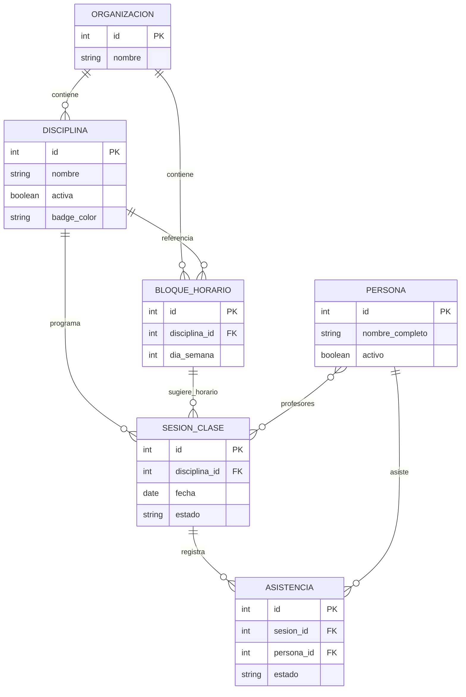
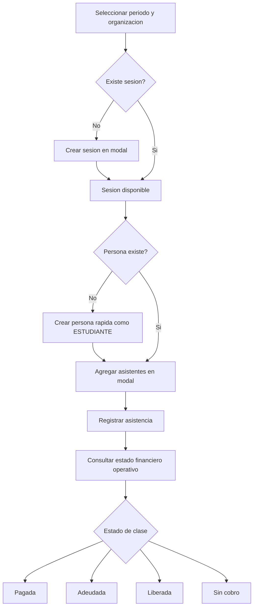
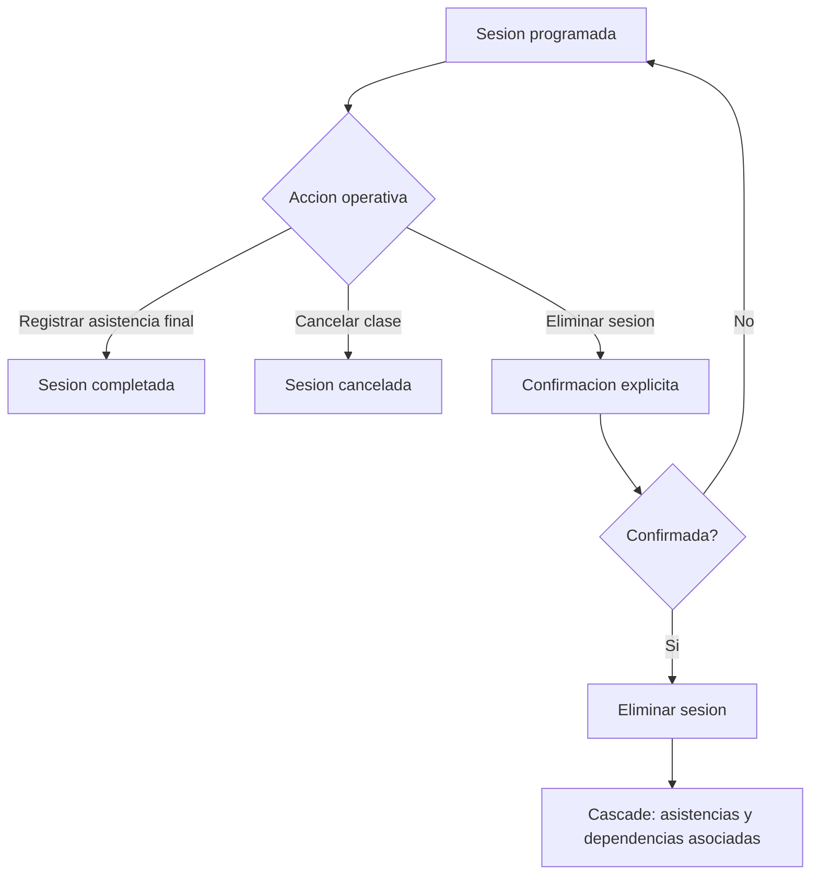
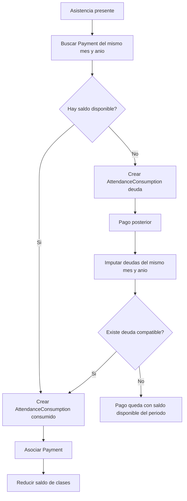

# Asistencias

Fecha de actualizacion: 2026-05-11

## Proposito
`asistencias` es la capa operativa diaria de la plataforma.

Debe privilegiar:
- velocidad de registro
- claridad operativa
- visibilidad academica y financiera inmediata

## Diagramas

### Modelo Local
Este diagrama muestra los modelos usados por `asistencias` y sus dependencias principales con `personas`.

### Flujo Actual De Registro De Asistencia
Este flujo resume la operacion diaria conocida: filtros globales, modales, registro y consulta del estado financiero operativo.

### Estados De Sesion
Este flujo muestra el ciclo operativo conocido de una sesion y el caso de eliminacion con confirmacion.

### Flujo Academico-Financiero
Este flujo conecta `asistencias` con la cobranza operacional de `finanzas`. La regla vigente limita el consumo al mismo mes y anio.

## Reglas vigentes
- Los filtros globales `periodo_mes`, `periodo_anio` y `organizacion` deben arrastrarse en toda la app.
- La app debe consumir el contexto global de filtros desde `plataformaelemental.context`; no debe exponer helpers compartidos desde `asistencias.views`.
- Si no hay filtros explicitos en la URL, el periodo global debe partir en el mes y año actuales, y la organizacion debe partir en `Todas`.
- Los filtros globales deben autoaplicarse al cambiar `mes`, `anio` u `organizacion`, sin boton manual de confirmacion.
- `periodo_mes` y `periodo_anio` deben aceptar la opcion `Todos`, permitiendo filtrar por todos los meses, todos los años, o combinaciones parciales como `todos los meses de un año` y `un mes en todos los años`.
- La administracion de organizaciones no vive aqui; vive en `personas`.
- Los enlaces hacia perfiles de persona deben dirigir a `personas/<id>/` y respetar siempre el periodo y la organizacion activos.
- Las asistencias deben poder verse junto con su estado financiero.
- Los modelos propios de esta app viven en `asistencias.models`; no deben declararse en `database`.
- El menu superior de `asistencias` debe ofrecer cierre de sesion mediante POST a `accounts/logout/`, redirigiendo al login principal.
- La barra compartida de apps vive en templates de `asistencias`, incluye `asistencias`, `finanzas`, `personas` y `monitor`, y debe permitir desplazamiento horizontal en mobile si no hay ancho suficiente.

## Decisiones funcionales vigentes
- La vista de profesores muestra solo profesores con asistencias o sesiones activas en el periodo.
- La vista de profesores debe mostrar cards resumen del periodo con alumnos unicos, sesiones realizadas, asistencias del mes y profesores activos, respetando la organizacion seleccionada.
- La tabla de profesores debe mostrar la organizacion como badge junto al nombre, no como columna independiente, y debe incluir pago bruto, retencion SII en monto y pago neto calculados desde `PersonaRol.valor_clase` y `PersonaRol.retencion_sii` de esa organizacion.
- El filtro local de organizacion bajo el titulo de profesores fue eliminado; se usa solo el filtro superior global.
- En detalle de sesion, el nombre del profesor enlaza al perfil consolidado en `personas/<id>/`.
- La app `asistencias` no mantiene vista propia `asistencias/personas/<id>/`; todos los enlaces a personas deben dirigir a `personas/<id>/` preservando filtros globales.
- En `asistencias/disciplinas/`, las disciplinas deben listarse con activas primero y, dentro de cada grupo, en orden alfabetico.
- En `asistencias/disciplinas/`, cada disciplina debe permitir elegir un color de badge desde creacion y edicion. Las opciones cerradas son: rojo, naranjo, azul, celeste, amarillo, verde, cafe y morado. El color elegido debe usarse en los badges de disciplina dentro de la app.
- En `asistencias/disciplinas/<id>/`, los profesores deben mostrarse en la descripcion general de la disciplina para el periodo activo, y la tabla de sesiones debe usar el orden `Fecha`, `Asistentes`, `Asistencias`, `Estado`, sin columnas separadas de presentes, ausentes o justificadas; esa tabla debe permitir orden por columna.
- En `asistencias/asistencias/`, los asistentes usan colores financieros:
  - amarillo: deuda
  - verde: pagada
  - azul: liberada o sin cobro
- En `asistencias/asistencias/`, la creacion rapida de persona debe asignar siempre la organizacion filtrada; si no hay organizacion seleccionada, debe bloquearse el alta y mostrar el error dentro del panel `Nueva persona`.
- En `asistencias/asistencias/`, el bloque `Nueva sesion` debe listar solo disciplinas activas y solo profesores activos con rol `PROFESOR` activo dentro de la organizacion filtrada.
- En toda seleccion operativa dentro de `asistencias`, una disciplina vigente equivale a `Disciplina.activa=True` y un profesor vigente equivale a `Persona.activo=True` mas `PersonaRol.activo=True` con rol `PROFESOR`; no deben aparecer opciones inactivas en filtros ni formularios editables.
- En `asistencias/asistencias/`, las acciones `Nueva sesion`, `Nueva persona` y `Agregar asistentes` deben mostrarse como una sola fila de botones en escritorio y abrirse en modales, para no desplazar el listado principal; en mobile pueden apilarse, pero mantienen el mismo flujo en modal.
- Todo enlace interno de la app que lleve a `asistencias/asistencias/` para agregar asistentes a una sesion debe incluir `sesion_id=<id>` y `open=agregar_asistentes`, para abrir el modal vigente y no depender de flujos embebidos antiguos.
- En `asistencias/asistencias/`, cuando la vista se abre con `open=<modal>` para forzar un modal, al cerrarlo debe limpiarse ese parametro del querystring sin recargar la pagina; esto aplica a `Nueva sesion`, `Nueva persona` y `Agregar asistentes`.
- En `asistencias/asistencias/`, cuando se selecciona una sesion para agregar asistentes, el selector debe usar checkboxes iguales al detalle de sesion y dejar marcados visualmente los estudiantes ya registrados.
- En `asistencias/asistencias/`, el modal `Agregar asistentes` debe mantener una altura fija para que la vista no cambie de tamaño segun la cantidad de resultados; el scroll debe ocurrir dentro del listado de estudiantes.
- En `asistencias/asistencias/`, el modal `Agregar asistentes` debe ofrecer dos salidas de guardado: `Guardar y cerrar`, que vuelve a la vista principal con la sesion aun seleccionada, y `Guardar y agregar otro`, que guarda y reabre el mismo modal.
- En `asistencias/asistencias/`, el indicador del panel de agregar asistentes debe mostrar el total de estudiantes unicos con asistencia en la misma disciplina de la sesion seleccionada, filtrado por periodo y organizacion.
- En `asistencias/sesiones/<id>/`, la eliminacion de una sesion debe pedir confirmacion explicita y borrar en cascada sus asistencias y dependencias asociadas.
- En `asistencias/sesiones/<id>/`, el listado de asistentes debe incluir estado de pago y permitir quitar asistentes individualmente desde la sesion, con confirmacion previa.
- En `asistencias/sesiones/<id>/`, debe existir una opcion para editar la sesion, manteniendo filtros globales y permitiendo actualizar disciplina, fecha y profesores.
- En `asistencias/sesiones/<id>/`, debe existir un modal de `Nueva persona` junto a `Eliminar sesion`; la persona creada queda automaticamente como `ESTUDIANTE` de la organizacion duena de esa sesion, no de la organizacion del filtro superior.
- En `asistencias/sesiones/`, una sesion cancelada debe mostrarse como `sesión cancelada` y no como `asistentes: 0`, para no confundir cancelacion con falta de registro.
- En `asistencias/sesiones/`, cada sesion debe mostrar un icono unico de estado: programada, completada o cancelada, visible tanto en calendario como en listado. En calendario, el icono debe quedar fuera del badge de disciplina, al mismo nivel visual, para que el estado se identifique rapidamente.
- En `asistencias/sesiones/`, si el filtro global no representa un mes y año unicos, la vista debe degradar de calendario mensual a listado simple de sesiones para no simular un mes inexistente.
- En el dashboard de `asistencias`, la seccion `Seguimiento de estudiantes` debe mostrarse en tablas y contener: todos los estudiantes con deuda por cantidad de clases, estudiantes con mas asistencia ordenados de mayor a menor con paginacion de 10 filas, y alumnos con clases disponibles en el periodo. No debe incluir el bloque `estudiantes sin asistencia`.
- En el dashboard de `asistencias`, las tablas que usen DataTables deben inicializarse solo cuando tengan filas reales de datos; los estados vacios deben mantener la cantidad real de columnas y no usar una unica fila con `colspan` dentro de la tabla inicializada.
- El resumen de profesor se consulta desde `personas/<id>/` y debe usar la configuracion de `PersonaRol` del rol `PROFESOR` para esa organizacion; el calculo base sigue siendo `asistencias del periodo x valor_clase`, sin hardcodear configuraciones en vistas de `asistencias`.

## Relacion con finanzas
- `asistencias` no define la verdad financiera completa.
- Solo consume el estado financiero necesario para operar.
- La logica global de pagos, documentos y caja vive en `finanzas`.
- Los consumos de clases y deudas usan modelos de `finanzas`, pero las entidades academicas base son propias de `asistencias`.

## Limite financiero
`asistencias` puede mostrar estado financiero operacional, pero no calcula contabilidad.

Permitido:
- consultar estado de pago/deuda de una asistencia
- mostrar si una clase esta pagada, adeudada, liberada o sin cobro
- llamar servicios de cobranza para casos de uso explicitos

No permitido:
- calcular IVA
- parsear documentos tributarios
- clasificar transacciones
- modificar pagos directamente desde templates
- depender de helpers internos de `finanzas.views` o `personas.views`

## API externa base
- `asistencias` expone una base de consumo externo en:
  - `/api/v1/asistencias/disciplinas/`
  - `/api/v1/asistencias/sesiones/`
  - `/api/v1/asistencias/sesiones/<id>/asistencias/`
  - `/api/v1/asistencias/asistencias/`
  - `/api/v1/asistencias/resumen/`
- Las consultas pueden usarse con API key de solo lectura.
- La carga de asistencias via API requiere usuario autenticado.
