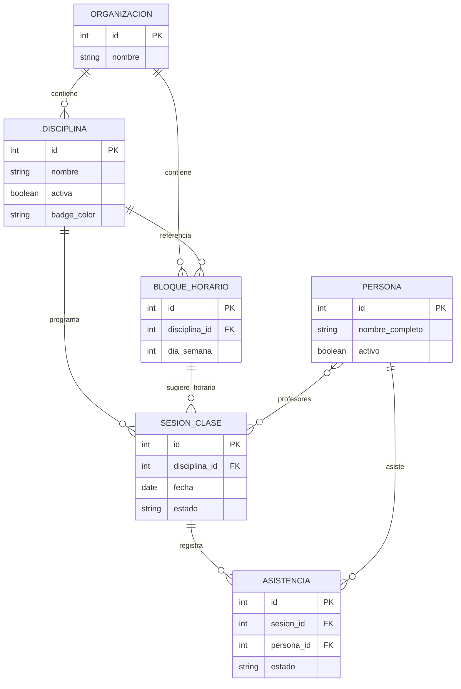
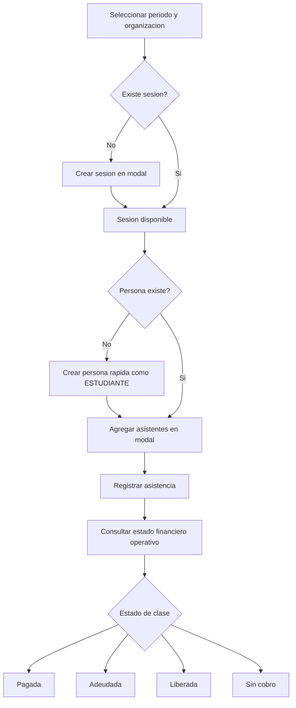
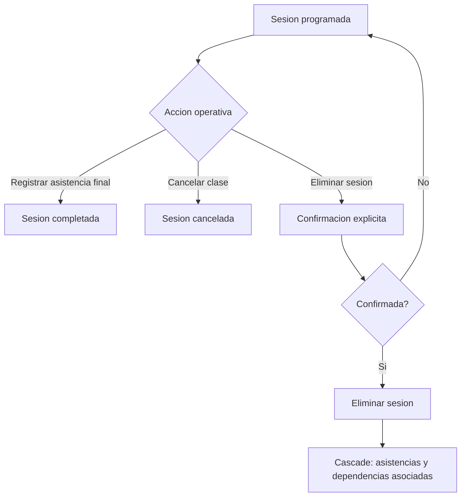
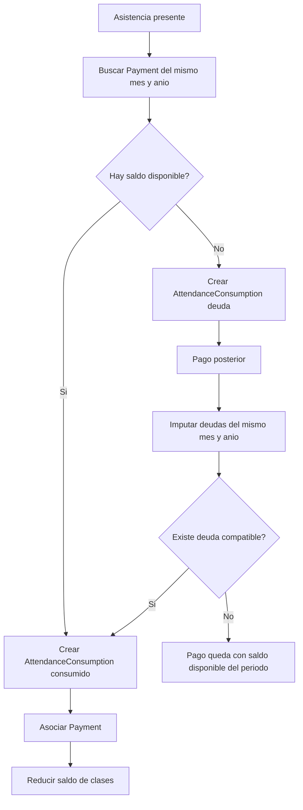

# Asistencias

Fecha de actualizacion: 2026-08-16

## Proposito
`asistencias` es la capa operativa diaria de la plataforma.

Debe privilegiar:
- velocidad de registro
- claridad operativa
- visibilidad academica y financiera inmediata

## Datos mensuales de prueba

El comando `poblar_mes_pruebas` genera un escenario operativo sintético e
idempotente sobre organizaciones, profesores y alumnos existentes. Está
bloqueado cuando `DEBUG=False` y sin `--aplicar` solo entrega un preview.

Requiere IDs explícitos para no guardar nombres, correos ni identificadores
personales en el código:

```bash
python manage.py poblar_mes_pruebas \
  --anio 2026 --mes 8 \
  --organizacion-elementos-id 1 --organizacion-latin-id 2 \
  --profesor-lyra-id 10 --profesor-latin-id 3 --profesor-circo-id 2
```

Agregar `--aplicar` confirma la escritura. Las sesiones y asistencias quedan
marcadas con `[DATOS_PRUEBA_MES_OPERATIVO]`; no se crean personas. El comando
mantiene las señales de dominio activas, por lo que cada asistencia genera su
`AttendanceConsumption`. Si no existen pagos de ese período, esos consumos
quedan correctamente como deuda sintética.

El escenario base produce:

- Lyra los lunes: una sesión cerrada, una abierta parcial y tres planificadas;
- LatinRengo los sábados: una cerrada, una atrasada sin información y tres
  planificadas;
- Tela Aérea los viernes: una abierta parcial y tres planificadas.

Evidencia del primer uso:
[docs/evidencia/poblado-agosto-20260810/RESULTADOS.md](../evidencia/poblado-agosto-20260810/RESULTADOS.md).

## Transición de relaciones históricas

El comando `reportar_relaciones_historicas` distingue historia y vigencia sin
modificar datos. Las sesiones no canceladas desde una fecha de corte identifican
asignaciones de profesor que deben conservarse o activarse explícitamente; una
sesión pasada no concede acceso. Las asistencias recientes solo generan una cola
de revisión de matrículas y nunca las activan automáticamente.

El detalle nominal se habilita explícitamente con
`--incluir-detalle-operativo`, contiene datos personales y no se versiona. En
Django Admin, asignaciones y matrículas disponen de una activación masiva tras
revisión: bloquea las filas, valida permiso por organización, revierte todo el
lote ante un error y audita cada activación. El borrado masivo está retirado de
estos dos administradores; desactivar una relación conserva la trazabilidad y
también se audita.

## Diagramas

### Modelo Local
Este diagrama muestra los modelos usados por `asistencias` y sus dependencias principales con `personas`.


```mermaid
erDiagram
    ORGANIZACION ||--o{ DISCIPLINA : contiene
    ORGANIZACION ||--o{ BLOQUE_HORARIO : contiene
    DISCIPLINA ||--o{ BLOQUE_HORARIO : referencia
    DISCIPLINA ||--o{ SESION_CLASE : programa
    BLOQUE_HORARIO ||--o{ SESION_CLASE : sugiere_horario
    PERSONA }o--o{ SESION_CLASE : profesores
    SESION_CLASE ||--o{ ASISTENCIA : registra
    PERSONA ||--o{ ASISTENCIA : asiste

    ORGANIZACION {
        int id PK
        string nombre
    }
    PERSONA {
        int id PK
        string nombre_completo
        boolean activo
    }
    DISCIPLINA {
        int id PK
        string nombre
        boolean activa
        string badge_color
    }
    BLOQUE_HORARIO {
        int id PK
        int disciplina_id FK
        int dia_semana
    }
    SESION_CLASE {
        int id PK
        int disciplina_id FK
        date fecha
        string estado
    }
    ASISTENCIA {
        int id PK
        int sesion_id FK
        int persona_id FK
        string estado
    }
```

### Flujo Actual De Registro De Asistencia
Este flujo resume la operacion diaria conocida: filtros globales, modales, registro y consulta del estado financiero operativo.


```mermaid
flowchart TD
    A["Seleccionar periodo y organizacion"] --> B{"Existe sesion?"}
    B -- "No" --> C["Crear sesion en modal"]
    C --> D["Sesion disponible"]
    B -- "Si" --> D
    D --> E{"Persona existe?"}
    E -- "No" --> F["Crear persona rapida como ESTUDIANTE"]
    F --> G["Agregar asistentes en modal"]
    E -- "Si" --> G
    G --> H["Registrar asistencia"]
    H --> I["Consultar estado financiero operativo"]
    I --> J{"Estado de clase"}
    J --> K["Pagada"]
    J --> L["Adeudada"]
    J --> M["Liberada"]
    J --> N["Sin cobro"]
```

### Estados De Sesion
Este flujo muestra el ciclo operativo conocido de una sesion y el caso de eliminacion con confirmacion.


```mermaid
flowchart TD
    A["Sesion programada"] --> B{"Accion operativa"}
    B -- "Registrar asistencia final" --> C["Sesion completada"]
    B -- "Cancelar clase" --> D["Sesion cancelada"]
    B -- "Eliminar sesion" --> E["Confirmacion explicita"]
    E --> F{"Confirmada?"}
    F -- "No" --> A
    F -- "Si" --> G["Eliminar sesion"]
    G --> H["Cascade: asistencias y dependencias asociadas"]
```

### Flujo Academico-Financiero
Este flujo conecta `asistencias` con la cobranza operacional de `finanzas`. La regla vigente limita el consumo al mismo mes y anio.


```mermaid
flowchart TD
    A["Asistencia presente"] --> B["Buscar Payment del mismo mes y anio"]
    B --> C{"Hay saldo disponible?"}
    C -- "Si" --> D["Crear AttendanceConsumption consumido"]
    D --> E["Asociar Payment"]
    E --> F["Reducir saldo de clases"]
    C -- "No" --> G["Crear AttendanceConsumption deuda"]
    G --> H["Pago posterior"]
    H --> I["Imputar deudas del mismo mes y anio"]
    I --> J{"Existe deuda compatible?"}
    J -- "Si" --> D
    J -- "No" --> K["Pago queda con saldo disponible del periodo"]
```

## Reglas vigentes
- Los filtros globales `periodo_mes`, `periodo_anio` y `organizacion` deben arrastrarse en toda la app.
- En modo Profesor, `organizacion` es obligatorio para toda pantalla operativa.
  Puede ser un ID autorizado o `todos`; este último agrega solo organizaciones
  con `PersonaRol(PROFESOR, activo=True)` y bloquea toda mutación. `/profesor/`
  sin parámetro solo muestra el selector y no consulta sesiones, alumnos, planes
  ni pagos. No existe inferencia por orden ni bypass por `is_staff`.
- La organización activa sirve para navegación y filtrado, pero no concede autorización. Las operaciones por identificador resuelven primero la sesión o disciplina desde un queryset autorizado y contrastan las relaciones compuestas contra la organización del objeto real.
- Una organización con rol Profesor activo y sin asignación docente operativa se
  mantiene visible, pero muestra estado vacío, no presenta acciones mutantes y
  rechaza con `403` las URLs directas de creación o pago. No usa otra
  organización como fallback.
- Solo `is_superuser` conserva alcance operativo global. `is_staff` permite entrar al Django Admin cuando Django lo autoriza, pero no reemplaza un `PersonaRol` activo ni amplía las organizaciones visibles en Asistencias.
- Una sesión ajena, una sesión no asignada a la profesora y una sesión inexistente responden `404` con estructura indistinguible en HTML, POST y endpoints JSON basados en objeto. Un `403` se reserva para negar una capacidad general antes de resolver un objeto.
- Los detalles y formularios de disciplina se resuelven desde el queryset de la organización autorizada. Un identificador ajeno y uno inexistente responden `404` tanto en GET como en POST; no existen endpoints JSON específicos de disciplina.
- Los permisos de la jornada se recalculan en cada petición. Desactivar el `User`, desactivar el `PersonaRol` de profesora, quitar su asignación en `SesionClase.profesores` o desactivar su `AsignacionProfesorDisciplina` operativa corta nuevas lecturas y escrituras aunque la sesión Django continúe abierta.
- La app debe consumir el contexto global de filtros desde `plataformaelemental.context`; no debe exponer helpers compartidos desde `asistencias.views`.
- Fuera del modo Profesor, si no hay filtros explícitos en la URL, el período
  global parte en el mes y año actuales y la organización parte en `Todas`.
  Profesor diferencia `organizacion=todos` de una organización concreta y exige
  aplicar el cambio desde su hoja de contexto.
- Los filtros administrativos globales autoaplican al cambiar. La hoja de
  contexto Profesor es la excepción intencional: permite revisar organización,
  período y tema, y solo navega al pulsar `Aplicar cambios`.
- `periodo_mes` y `periodo_anio` deben aceptar la opcion `Todos`, permitiendo filtrar por todos los meses, todos los años, o combinaciones parciales como `todos los meses de un año` y `un mes en todos los años`.
- La administracion de organizaciones no vive aqui; vive en `personas`.
- Los enlaces hacia perfiles de persona deben dirigir a `personas/<id>/` y respetar siempre el periodo y la organizacion activos.
- Las asistencias deben poder verse junto con su estado financiero.
- Los modelos propios de esta app viven en `asistencias.models`.
- El menu superior de `asistencias` debe ofrecer cierre de sesion mediante POST a `accounts/logout/`, redirigiendo al login principal.
- La navegacion principal vive en el sidebar global de `Elemental Apps`; `monitor` queda archivado y no forma parte de la navegacion activa v1.0.

## Decisiones funcionales vigentes
- En Profesor, mes/año se transportan juntos o se usa `periodo=todos`; mezclar
  ambos contratos devuelve `404`. El historial total se ordena por fecha e ID
  descendentes y se pagina de 25 en 25.
- El buscador de asistentes Profesor parte de `AlumnoDisciplina` operativa y de
  un rol `ESTUDIANTE` activo en la organización de la disciplina. No exige una
  asistencia histórica. El POST vuelve a comprobar sesión, organización,
  matrícula y asignación docente.
- Un profesor asignado puede quitar asistentes y liberar/revertir la clase
  individual. Ambas operaciones son atómicas; la primera audita los IDs antes
  de borrar la asistencia y la segunda conserva `ClaseLiberada` y recalcula el
  consumo financiero mediante el servicio de dominio existente.
- La vista de profesores muestra solo profesores con asistencias o sesiones activas en el periodo.
- La vista de profesores debe mostrar cards resumen del periodo con alumnos unicos, sesiones realizadas, asistencias del mes y profesores activos, respetando la organizacion seleccionada.
- La tabla de profesores debe mostrar la organizacion como badge junto al nombre, no como columna independiente, y debe incluir pago bruto, retencion SII en monto y pago neto calculados desde `PersonaRol.valor_clase` y `PersonaRol.retencion_sii` de esa organizacion.
- El filtro local de organizacion bajo el titulo de profesores fue eliminado; se usa solo el filtro superior global.
- En detalle de sesion, el nombre del profesor enlaza al perfil consolidado en `personas/<id>/`.
- La app `asistencias` no mantiene vista propia `asistencias/personas/<id>/`; todos los enlaces a personas deben dirigir a `personas/<id>/` preservando filtros globales.
- En `asistencias/disciplinas/`, las disciplinas deben listarse con activas primero y, dentro de cada grupo, en orden alfabetico.
- En `asistencias/disciplinas/`, cada disciplina debe permitir elegir un color de badge desde creacion y edicion. Las opciones cerradas son: rojo, naranjo, azul, celeste, amarillo, verde, cafe y morado. El color elegido debe usarse en los badges de disciplina dentro de la app.
- En `asistencias/disciplinas/<id>/`, los profesores deben mostrarse en la descripcion general de la disciplina para el periodo activo, y la tabla de sesiones debe usar el orden `Fecha`, `Asistentes`, `Asistencias`, `Estado`, sin columnas separadas de presentes, ausentes o justificadas; esa tabla debe permitir orden por columna.
- En `asistencias/asistencias/`, los asistentes usan colores financieros:
  - amarillo: deuda
  - verde: pagada
  - azul: liberada o sin cobro
- En `asistencias/asistencias/`, la creacion rapida de persona debe asignar siempre la organizacion filtrada; si no hay organizacion seleccionada, debe bloquearse el alta y mostrar el error dentro del panel `Nueva persona`.
- En `asistencias/asistencias/`, el bloque `Nueva sesion` debe listar solo disciplinas activas y solo profesores activos con rol `PROFESOR` activo dentro de la organizacion filtrada.
- En toda seleccion operativa dentro de `asistencias`, una disciplina vigente equivale a `Disciplina.activa=True` y un profesor vigente equivale a `Persona.activo=True` mas `PersonaRol.activo=True` con rol `PROFESOR`; no deben aparecer opciones inactivas en filtros ni formularios editables.
- En `asistencias/asistencias/`, las acciones `Nueva sesion`, `Nueva persona` y `Agregar asistentes` deben mostrarse como una sola fila de botones en escritorio y abrirse en modales, para no desplazar el listado principal; en mobile pueden apilarse, pero mantienen el mismo flujo en modal.
- Todo enlace interno de la app que lleve a `asistencias/asistencias/` para agregar asistentes a una sesion debe incluir `sesion_id=<id>` y `open=agregar_asistentes`, para abrir el modal vigente y no depender de flujos embebidos antiguos.
- En `asistencias/asistencias/`, cuando la vista se abre con `open=<modal>` para forzar un modal, al cerrarlo debe limpiarse ese parametro del querystring sin recargar la pagina; esto aplica a `Nueva sesion`, `Nueva persona` y `Agregar asistentes`.
- En `asistencias/asistencias/`, cuando se selecciona una sesion para agregar asistentes, el selector debe usar checkboxes iguales al detalle de sesion y dejar marcados visualmente los estudiantes ya registrados.
- En `asistencias/asistencias/`, el modal `Agregar asistentes` incluye selector de sesion. Si viene desde una sesion queda preseleccionada; si se abre desde una vista general, permite elegir una sesion del periodo y organizacion activos antes de cargar estudiantes.
- El POST de `Agregar asistentes` valida la sesion contra organizacion y periodo activos para impedir asociar estudiantes a sesiones de otra organizacion mediante request manual.
- En `asistencias/asistencias/`, el modal `Agregar asistentes` debe listar solo estudiantes de la organizacion de la sesion seleccionada. Los estudiantes inactivos no se ocultan: se muestran con marca `Inactivo` y al agregarlos a una sesion se reactiva su persona y su rol `ESTUDIANTE` en esa organizacion.
- En `asistencias/asistencias/`, el modal `Agregar asistentes` debe mantener una altura fija para que la vista no cambie de tamaño segun la cantidad de resultados; el scroll debe ocurrir dentro del listado de estudiantes.
- En `asistencias/asistencias/`, el modal `Agregar asistentes` debe ofrecer dos salidas de guardado: `Guardar y cerrar`, que vuelve a la vista principal con la sesion aun seleccionada, y `Guardar y agregar otro`, que guarda y reabre el mismo modal.
- En `asistencias/asistencias/`, el indicador del panel de agregar asistentes debe mostrar el total de estudiantes unicos con asistencia en la misma disciplina de la sesion seleccionada, filtrado por periodo y organizacion.
- En `asistencias/sesiones/<id>/`, la eliminacion de una sesion debe pedir confirmacion explicita y borrar en cascada sus asistencias y dependencias asociadas.
- En `asistencias/sesiones/<id>/`, el listado de asistentes debe incluir estado de pago y permitir quitar asistentes individualmente desde la sesion, con confirmacion previa.
- En `asistencias/sesiones/<id>/`, el bloque `Agregar asistentes` debe respetar la misma regla que `asistencias/asistencias/`: estudiantes de la organizacion de la sesion, inactivos visibles con marca y reactivacion al agregarlos.
- En `asistencias/sesiones/<id>/`, el backend movil para agregar asistentes expone endpoints JSON internos bajo la sesion: `asistentes/buscar/` y `asistentes/agregar/`. Ambos validan permisos contra `sesion.disciplina.organizacion`, no confian en la organizacion activa ni en datos enviados por POST. La busqueda devuelve solo `id`, `nombre` e `inactivo`, excluye asistentes ya agregados y limita resultados. El alta valida rol `ESTUDIANTE` en la organizacion real, usa `get_or_create` dentro de transaccion, reactiva al estudiante si corresponde, sincroniza `AttendanceConsumption` mediante el servicio de `finanzas` y audita la accion.
- Las búsquedas de asistentes, alumnos para pago masivo y filtros locales de
  alumnos/profesores aceptan varios fragmentos y no exigen tildes. El backend
  reutiliza `personas.search.filtrar_por_fragmentos` después de acotar el
  queryset a la organización, matrícula y asignación autorizadas; el navegador
  reutiliza `shared/_busqueda_texto_script.html` para filtros que no consultan al
  servidor.
- En `asistencias/sesiones/<id>/`, debe existir una opcion para editar la sesion, manteniendo filtros globales y permitiendo actualizar disciplina, fecha y profesores.
- En `asistencias/sesiones/<id>/`, debe existir un modal de `Nueva persona` junto a `Eliminar sesion`; la persona creada queda automaticamente como `ESTUDIANTE` de la organizacion duena de esa sesion, no de la organizacion del filtro superior.
- En `asistencias/sesiones/<id>/`, el modal `Nueva persona` incluye el switch `Agregar a esta sesión`, activo por defecto. Si esta activo, crea la persona, la asigna como estudiante de la organizacion de la sesion y crea la asistencia con `get_or_create`; si esta inactivo, solo crea la persona.
- En `asistencias/sesiones/<id>/`, el alta rápida de personas sigue restringida a administración autorizada de la organización o al rol operativo `STAFF_ASISTENCIA`; el atributo Django `is_staff` por sí solo no concede esa capacidad.
- La edición de una sesión y el cambio rápido de su estado cargan la sesión desde el conjunto visible para el usuario y verifican la organización real. Un identificador ajeno o inexistente devuelve `404` y no modifica datos.
- El detalle de una sesión vista por profesor ofrece anterior/siguiente dentro
  del queryset autorizado. Administración conserva su navegación por calendario
  y listados filtrados.
- En `asistencias/calendario/`, una sesion cancelada debe mostrarse como `sesión cancelada` y no como `asistentes: 0`, para no confundir cancelacion con falta de registro.
- En `asistencias/calendario/`, cada sesion debe mostrar un icono unico de estado: programada, completada o cancelada, visible tanto en calendario como en listado. En calendario, el icono debe quedar fuera del badge de disciplina, al mismo nivel visual, para que el estado se identifique rapidamente.
- En `asistencias/calendario/`, si el filtro global no representa un mes y año unicos, la vista debe degradar de calendario mensual a listado simple de sesiones para no simular un mes inexistente.
- En `asistencias/calendario/`, se pueden crear sesiones masivas para el mes seleccionado indicando disciplina, dias de la semana, profesores opcionales y un maximo opcional de sesiones. Las fechas duplicadas para la misma disciplina se omiten.
- `asistencias/sesiones/` queda como redireccion compatible hacia `asistencias/calendario/`; los detalles de sesion siguen viviendo en `asistencias/sesiones/<id>/`.
- En el panel de `asistencias`, la seccion `Seguimiento de estudiantes` debe mostrarse en tablas y contener: todos los estudiantes con deuda por cantidad de clases, estudiantes con mas asistencia ordenados de mayor a menor con paginacion de 10 filas, y alumnos con clases disponibles en el periodo. No debe incluir el bloque `estudiantes sin asistencia`.
- En el panel de `asistencias`, las tablas que usen DataTables deben inicializarse solo cuando tengan filas reales de datos; los estados vacios deben mantener la cantidad real de columnas y no usar una unica fila con `colspan` dentro de la tabla inicializada.
- El resumen de profesor se consulta desde `personas/<id>/` y debe usar la configuracion de `PersonaRol` del rol `PROFESOR` para esa organizacion; el calculo base sigue siendo `asistencias del periodo x valor_clase`, sin hardcodear configuraciones en vistas de `asistencias`.

## Estado financiero en Disciplina

El detalle de una disciplina muestra por estudiante un estado operacional calculado en un selector masivo, limitado a la disciplina, organización y periodo visibles. Las etiquetas son textuales y se acompañan de icono decorativo y clase de color: `Al día`, `Deuda`, `Sin plan`, `Pendiente` e `Información incompleta` cuando una combinación requiere revisión.

La vista no calcula deuda en el template ni consulta pagos por persona. Los pagos y consumos se agregan en consultas agrupadas; el enlace al perfil solo se renderiza dentro del detalle de disciplina autorizado y conserva los filtros globales. La clasificación respeta el mismo mes y año, pagos revertidos excluidos, consumos y deuda del dominio financiero; un `Payment` directo sin plan sigue siendo un derecho válido si cubre el consumo.
- En `asistencias/estudiantes/`, la tabla operacional muestra metricas academicas y de cobranza del periodo: clases pagadas, usadas, restantes, total pagado, ultimo pago, asistencias, deuda y estado financiero simple. Estas metricas son operacionales y se calculan en selector, no en template.
- En `asistencias/estudiantes/`, las acciones rapidas minimas son: perfil, asistencia, estado financiero y registrar pago cuando el usuario tenga permiso financiero. Las URLs preservan periodo y organizacion.

## Relacion con finanzas
- `asistencias` no define la verdad financiera completa.
- Solo consume el estado financiero necesario para operar.
- La logica global de pagos, documentos y caja vive en `finanzas`.
- Los consumos de clases y deudas usan modelos de `finanzas`, pero las entidades academicas base son propias de `asistencias`.
- La tabla enriquecida de estudiantes usa `Payment` y `AttendanceConsumption` solo como cobranza operacional; no usa `Transaction` ni representa contabilidad.

## Transiciones de asistencia y consumo

El servicio de dominio recalcula el mismo `AttendanceConsumption` dentro de una transacción. La presencia académica no cambia: `AUSENTE` y `JUSTIFICADA` siguen registrando lo ocurrido en clase, pero financieramente pierden el cupo mensual igual que una asistencia presente.

| Estado o transición | Resultado esperado |
| --- | --- |
| creación `PRESENTE` | `CONSUMIDO` con derecho mensual; de lo contrario `DEUDA` |
| creación `AUSENTE` | `CONSUMIDO` con derecho mensual; de lo contrario `DEUDA` |
| creación `JUSTIFICADA` | `CONSUMIDO` con derecho mensual; de lo contrario `DEUDA` |
| `PRESENTE → AUSENTE` | mantiene o recalcula el consumo; no recupera cupo |
| `PRESENTE → JUSTIFICADA` | mantiene o recalcula el consumo; no recupera cupo |
| `AUSENTE/JUSTIFICADA → PRESENTE` | recalcula idempotentemente sin duplicar consumo |
| mismo estado | no duplica ni consume una clase adicional |
| clase liberada activa | `PENDIENTE`, sin pago ni deuda |
| reversa de clase liberada | vuelve al cálculo ordinario según la asistencia |

`PENDIENTE` se reserva para excepciones explícitas que no consumen, como una clase liberada. Las correcciones entre estados ordinarios no devuelven clases.

La eliminación vigente de una asistencia elimina en cascada su único consumo; el pago deja de contabilizarlo y recupera el cupo. La acción permanece auditada desde la vista y no se incorpora una reversa histórica de asistencia en este sprint.

El signal de `Asistencia` invoca el servicio tanto en creación como en actualización. El servicio bloquea la asistencia, su consumo y los pagos candidatos para impedir sobreconsumo por reintentos o carreras.

## Clase liberada

`ClaseLiberada` es una excepción explícita e histórica:

- conserva la asistencia;
- exige motivo;
- registra organización, autor y fecha;
- fuerza el consumo a `PENDIENTE` sin pago;
- no genera cobro ni usa saldo;
- solo administración autorizada de la organización puede crearla o revertirla;
- la reversa conserva el registro y vuelve a ejecutar el recálculo ordinario;
- profesora asignada puede consultar el resultado, pero no liberar ni revertir.

No equivale a ausencia, justificación, deuda, beca ni eliminación.

## Periodo mensual y promociones

- Pago, plan y clase deben pertenecer al mismo mes y año; no existe arrastre, recuperación posterior ni vigencia móvil de 30 días.
- Un pago puede respaldar varios consumos siempre que `clases_asignadas` tenga cupo suficiente.
- Las promociones, incluido un eventual beneficio 2x1, se gestionan ajustando manualmente `clases_asignadas`.
- No existe detección, asignación ni duplicación automática de promociones.
- Los consumos históricos fuera de estas reglas requieren saneamiento manual por el gestor; el reconciliador solo los identifica.

## Exportaciones Excel v1.0
- `asistencias_YYYY_MM.xlsx` exporta asistencias operativas desde `Asistencia`, `SesionClase`, `Disciplina` y `Persona`.
- El archivo incluye fecha, disciplina, estudiante, estado de asistencia, profesores, organizacion, observacion y periodo.
- La exportacion respeta periodo, organizacion activa y filtro local de disciplina cuando existe.
- La exportacion usa permiso transversal `exportar_datos`; no habilita exportacion para profesores ni solo lectura.
- Esta exportacion es academica/operacional: no reemplaza reportes financieros ni libro de caja.

## Limite financiero
`asistencias` puede mostrar estado financiero operacional, pero no calcula contabilidad.

Permitido:
- consultar estado de pago/deuda de una asistencia
- mostrar si una clase esta pagada, adeudada, liberada o sin cobro
- llamar servicios de cobranza para casos de uso explicitos

No permitido:
- calcular IVA
- parsear documentos tributarios
- clasificar transacciones
- modificar pagos directamente desde templates
- depender de helpers internos de `finanzas.views` o `personas.views`

## Endpoints JSON internos — sesión móvil

### `GET sesiones/<pk>/asistentes/buscar/?q=<termino>`

Busca estudiantes elegibles para agregar a la sesión.

**Autenticación:** requiere administración autorizada o una profesora con rol
`PROFESOR` activo y asignación efectiva a la sesión. La sesión se filtra por su
organización real; una profesora no asignada y una persona de otra organización
reciben la misma respuesta que una sesión inexistente.

**Restricciones de búsqueda:**
- Mínimo 2 caracteres en `q`; con menos de 2 se devuelve `{"ok": true, "resultados": []}` sin consultar DB.
- Excluye personas ya registradas en la sesión.

La búsqueda filtra personas con rol ESTUDIANTE en la organización de la sesión. Puede incluir roles inactivos, marcados con inactivo=true, para permitir su reactivación mediante el flujo existente.
El parámetro `q` se divide por espacios: todos los fragmentos deben aparecer en
alguno de los campos nombre, apellido, correo o RUT, sin sensibilidad a tildes.

- Limita a 10 resultados.
- Devuelve solo `id`, `nombre` e `inactivo`; no expone email ni RUT.

**Respuesta exitosa (200):**
```json
{
  "ok": true,
  "resultados": [
    {"id": 1, "nombre": "Ana García", "inactivo": false}
  ]
}
```

**Códigos de error:**

| HTTP | codigo | condición |
|------|--------|-----------|
| 403 | `PERMISO_DENEGADO` | no autenticado o sin rol base en ninguna org |
| 404 | `SESION_NO_ENCONTRADA` | sesión inexistente **o** sesión de organización no autorizada (indistinguible) |

---

### `POST sesiones/<pk>/asistentes/agregar/`

Crea una `Asistencia` y su `AttendanceConsumption` para la sesión.

**Body:** `multipart/form-data` o `application/json` con campo `persona_id`.

**Respuesta exitosa (201):**
```json
{
  "ok": true,
  "asistencia": {
    "id": 42,
    "persona_id": 7,
    "nombre": "Ana García",
    "estado": "presente",
    "estado_label": "Presente",
    "persona_url": "/personas/7/",
    "hora": "10:30"
  },
  "estado_financiero": {
    "codigo": "consumido|deuda|pendiente|sin_consumo",
    "label": "Pagada|Deuda|Sin cobro|Sin consumo"
  },
  "total": 5,
  "mensaje": "Asistente agregado"
}
```

Para una profesora, `persona_url` no se entrega y `estado_financiero` se devuelve
como `null`. La única excepción financiera visible es `clase_liberada=true`,
presentada como información de solo lectura. Administración conserva el contrato
financiero operacional existente.

**Mapeo de `codigo` a clase Bootstrap (responsabilidad del frontend):**

| codigo | clase |
|--------|-------|
| `consumido` | `success` |
| `deuda` | `danger` |
| `pendiente` | `secondary` |
| `sin_consumo` | `light` |

**Flujo financiero:** el `post_save` de `Asistencia` llama `asignar_consumo_asistencia` automáticamente. El endpoint no realiza una segunda llamada. El `AttendanceConsumption` resultante es consultado **después** del bloque atómico para incluir el estado real en la respuesta.

**Códigos de error:**

| HTTP | codigo | condición |
|------|--------|-----------|
| 400 | `PERSONA_REQUERIDA` | campo `persona_id` ausente |
| 400 | `PERSONA_INVALIDA` | `persona_id` no numérico o persona no es estudiante de la org |
| 400 | `JSON_INVALIDO` | body `application/json` malformado |
| 403 | `PERMISO_DENEGADO` | no autenticado o sin rol base |
| 404 | `SESION_NO_ENCONTRADA` | sesión inexistente o de org no autorizada (indistinguible) |
| 409 | `ASISTENCIA_DUPLICADA` | persona ya está en la sesión |

---

### `POST sesiones/<pk>/asistencias/<asistencia_pk>/estado/`

Cambia rápidamente el estado entre `PRESENTE`, `AUSENTE` y `JUSTIFICADA`.
Valida en servidor la sesión, su organización, la asignación de la profesora y
que la asistencia pertenezca a esa sesión. Delega el recálculo al servicio
idempotente del dominio; ausencias y justificaciones no recuperan cupo.

**Body:** `multipart/form-data` o `application/json` con campo `estado`.

**Respuesta exitosa (200):**
```json
{
  "ok": true,
  "asistencia": {
    "id": 42,
    "persona_id": 7,
    "nombre": "Ana García",
    "estado": "ausente",
    "estado_label": "Ausente",
    "hora": "10:30",
    "clase_liberada": false
  },
  "estado_financiero": null,
  "mensaje": "Asistencia guardada."
}
```

**Códigos de error:**

| HTTP | codigo | condición |
|------|--------|-----------|
| 400 | `JSON_INVALIDO` | body `application/json` malformado |
| 400 | `ESTADO_INVALIDO` | estado ausente o fuera de las opciones válidas |
| 403 | `PERMISO_DENEGADO` | no autenticado o sin rol base |
| 404 | `SESION_NO_ENCONTRADA` | sesión inexistente o no autorizada |
| 404 | `ASISTENCIA_NO_ENCONTRADA` | asistencia inexistente o ajena a la sesión |

## Jornada móvil de profesoras — base histórica Sprint 3

- `GET /asistencias/hoy/` lista solamente las sesiones del día accesibles para
  el usuario. Para profesoras exige rol activo en la organización y asignación
  en `SesionClase.profesores`; el queryset aplica ambas restricciones.
- El detalle reutiliza ese mismo queryset: una sesión inexistente, no asignada
  o de otra organización responde 404 sin revelar si el identificador existe.
- La lista se ordena cronológicamente, deja sesiones sin horario al final y
  expresa con texto si una sesión está pasada, en curso, próxima, finalizada o
  cancelada.
- El detalle prioriza identidad de sesión, búsqueda incremental, asistentes y
  edición rápida. Después de agregar, el buscador se limpia y recupera foco; en
  un error corregible conserva el texto para reintentar.
- Doble envío y reintentos no crean asistencias duplicadas. El servidor responde
  `ASISTENCIA_DUPLICADA` con HTTP 409.
- La profesora no recibe enlaces a fichas de personas, datos financieros,
  controles de liberación, pagos ni eliminación de asistentes. Una clase
  liberada se muestra únicamente como estado informativo.
- La navegación anterior incorporaba solo `Hoy`. La superficie vigente es
  `/profesor/`, con Inicio, Mis clases, Alumnos y Pagos; el detalle de sesión
  continúa reutilizando los endpoints endurecidos de esta sección.
- Google sigue detrás de los flags existentes. Autenticarse no crea rol,
  organización ni asignación y no concede por sí solo acceso a la jornada.

## Operación Profesor vigente

- `AsignacionProfesorDisciplina` autoriza la clase; `SesionClase.profesores`
  autoriza la sesión concreta y `AlumnoDisciplina` acota roster, búsqueda y pago.
- Una relación operativa debe estar activa y ser explícita, o ser histórica con
  actor y fecha de revisión administrativa. `activa=True` por sí solo no basta
  para una relación inferida.
- El primer asistente registrado por profesor cambia una sesión planificada a
  `abierta`; cerrar requiere acción explícita y auditada.
- Una profesora crea sesiones futuras propias, puede abrirlas, cerrarlas y
  liberarlas con motivo obligatorio mediante `LiberacionSesion`.
- Crear un alumno exige teléfono o correo válido y crea matrícula únicamente en
  una disciplina asignada a la profesora.
- La búsqueda incremental de sesión dejó de listar a todos los estudiantes de
  la organización para profesoras y staff de asistencia: exige matrícula
  operativa en la disciplina. Solo administración de personas puede convertir
  explícitamente una persona de la organización en matrícula vigente.
- La migración `asistencias.0004` deriva asignaciones históricas desde sesiones
  y asistencias sin borrar datos, pero las crea con `origen=historica` y
  `activa=False`. La señal de asistencia conserva esa trazabilidad y nunca
  reactiva una matrícula.
- `reportar_relaciones_historicas --formato=json --fallar-si-inseguro` entrega
  conteos sin datos personales y bloquea el gate si existe historia activa sin
  revisión completa.
- Contrato completo: [OPERACION_PROFESOR.md](OPERACION_PROFESOR.md).

## API
La API de datos de `asistencias` queda desactivada en v1.0.

Motivo:
- no existe consumidor real actual
- reduce superficie mutable y de lectura sobre asistencia
- evita mantener endpoints "por si acaso"

Las asistencias se operan desde HTML server-rendered hasta nueva decision explicita.
