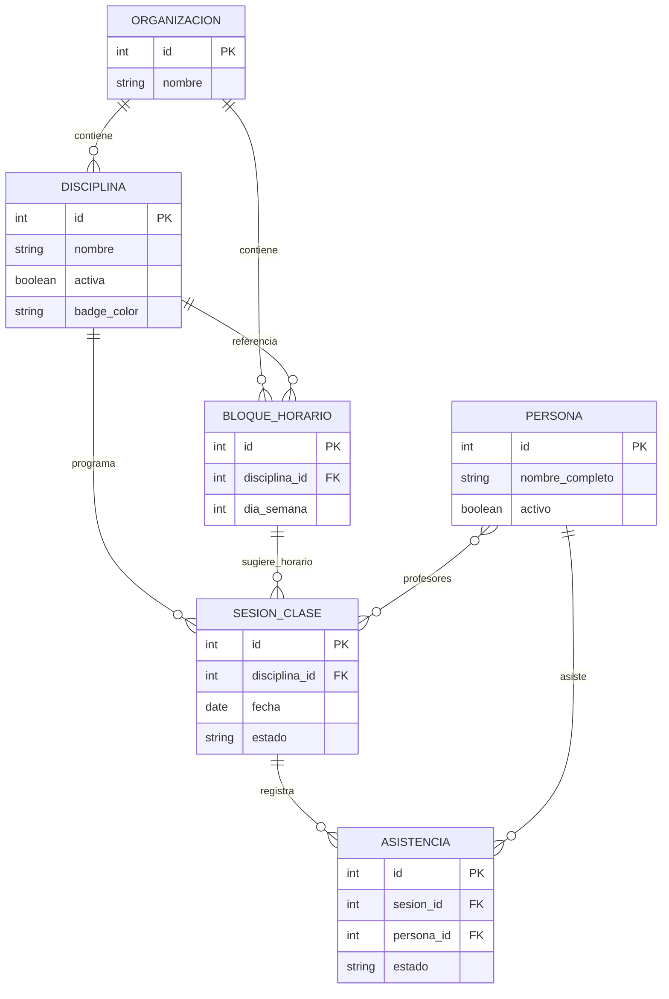
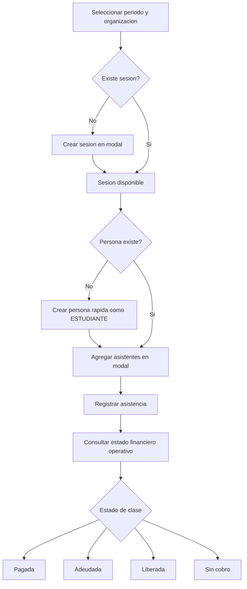
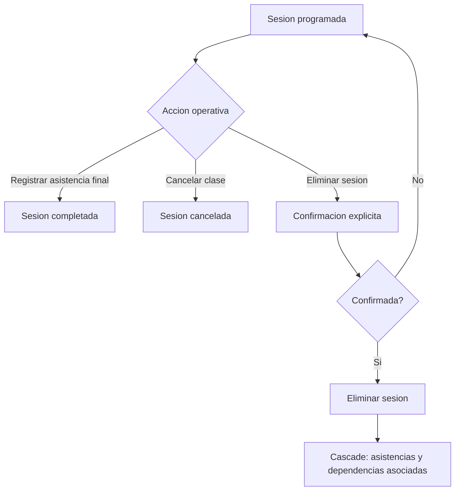
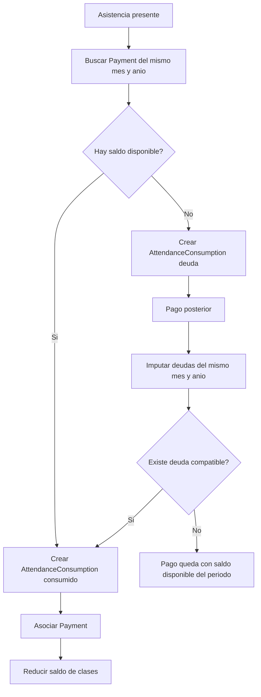

# Asistencias

Fecha de actualizacion: 2026-05-29

## Proposito
`asistencias` es la capa operativa diaria de la plataforma.

Debe privilegiar:
- velocidad de registro
- claridad operativa
- visibilidad academica y financiera inmediata

## Diagramas

### Modelo Local
Este diagrama muestra los modelos usados por `asistencias` y sus dependencias principales con `personas`.


```mermaid
erDiagram
    ORGANIZACION ||--o{ DISCIPLINA : contiene
    ORGANIZACION ||--o{ BLOQUE_HORARIO : contiene
    DISCIPLINA ||--o{ BLOQUE_HORARIO : referencia
    DISCIPLINA ||--o{ SESION_CLASE : programa
    BLOQUE_HORARIO ||--o{ SESION_CLASE : sugiere_horario
    PERSONA }o--o{ SESION_CLASE : profesores
    SESION_CLASE ||--o{ ASISTENCIA : registra
    PERSONA ||--o{ ASISTENCIA : asiste

    ORGANIZACION {
        int id PK
        string nombre
    }
    PERSONA {
        int id PK
        string nombre_completo
        boolean activo
    }
    DISCIPLINA {
        int id PK
        string nombre
        boolean activa
        string badge_color
    }
    BLOQUE_HORARIO {
        int id PK
        int disciplina_id FK
        int dia_semana
    }
    SESION_CLASE {
        int id PK
        int disciplina_id FK
        date fecha
        string estado
    }
    ASISTENCIA {
        int id PK
        int sesion_id FK
        int persona_id FK
        string estado
    }
```

### Flujo Actual De Registro De Asistencia
Este flujo resume la operacion diaria conocida: filtros globales, modales, registro y consulta del estado financiero operativo.


```mermaid
flowchart TD
    A["Seleccionar periodo y organizacion"] --> B{"Existe sesion?"}
    B -- "No" --> C["Crear sesion en modal"]
    C --> D["Sesion disponible"]
    B -- "Si" --> D
    D --> E{"Persona existe?"}
    E -- "No" --> F["Crear persona rapida como ESTUDIANTE"]
    F --> G["Agregar asistentes en modal"]
    E -- "Si" --> G
    G --> H["Registrar asistencia"]
    H --> I["Consultar estado financiero operativo"]
    I --> J{"Estado de clase"}
    J --> K["Pagada"]
    J --> L["Adeudada"]
    J --> M["Liberada"]
    J --> N["Sin cobro"]
```

### Estados De Sesion
Este flujo muestra el ciclo operativo conocido de una sesion y el caso de eliminacion con confirmacion.


```mermaid
flowchart TD
    A["Sesion programada"] --> B{"Accion operativa"}
    B -- "Registrar asistencia final" --> C["Sesion completada"]
    B -- "Cancelar clase" --> D["Sesion cancelada"]
    B -- "Eliminar sesion" --> E["Confirmacion explicita"]
    E --> F{"Confirmada?"}
    F -- "No" --> A
    F -- "Si" --> G["Eliminar sesion"]
    G --> H["Cascade: asistencias y dependencias asociadas"]
```

### Flujo Academico-Financiero
Este flujo conecta `asistencias` con la cobranza operacional de `finanzas`. La regla vigente limita el consumo al mismo mes y anio.


```mermaid
flowchart TD
    A["Asistencia presente"] --> B["Buscar Payment del mismo mes y anio"]
    B --> C{"Hay saldo disponible?"}
    C -- "Si" --> D["Crear AttendanceConsumption consumido"]
    D --> E["Asociar Payment"]
    E --> F["Reducir saldo de clases"]
    C -- "No" --> G["Crear AttendanceConsumption deuda"]
    G --> H["Pago posterior"]
    H --> I["Imputar deudas del mismo mes y anio"]
    I --> J{"Existe deuda compatible?"}
    J -- "Si" --> D
    J -- "No" --> K["Pago queda con saldo disponible del periodo"]
```

## Reglas vigentes
- Los filtros globales `periodo_mes`, `periodo_anio` y `organizacion` deben arrastrarse en toda la app.
- La app debe consumir el contexto global de filtros desde `plataformaelemental.context`; no debe exponer helpers compartidos desde `asistencias.views`.
- Si no hay filtros explicitos en la URL, el periodo global debe partir en el mes y año actuales, y la organizacion debe partir en `Todas`.
- Los filtros globales deben autoaplicarse al cambiar `mes`, `anio` u `organizacion`, sin boton manual de confirmacion.
- `periodo_mes` y `periodo_anio` deben aceptar la opcion `Todos`, permitiendo filtrar por todos los meses, todos los años, o combinaciones parciales como `todos los meses de un año` y `un mes en todos los años`.
- La administracion de organizaciones no vive aqui; vive en `personas`.
- Los enlaces hacia perfiles de persona deben dirigir a `personas/<id>/` y respetar siempre el periodo y la organizacion activos.
- Las asistencias deben poder verse junto con su estado financiero.
- Los modelos propios de esta app viven en `asistencias.models`.
- El menu superior de `asistencias` debe ofrecer cierre de sesion mediante POST a `accounts/logout/`, redirigiendo al login principal.
- La navegacion principal vive en el sidebar global de `Elemental Apps`; `monitor` queda archivado y no forma parte de la navegacion activa v1.0.

## Decisiones funcionales vigentes
- La vista de profesores muestra solo profesores con asistencias o sesiones activas en el periodo.
- La vista de profesores debe mostrar cards resumen del periodo con alumnos unicos, sesiones realizadas, asistencias del mes y profesores activos, respetando la organizacion seleccionada.
- La tabla de profesores debe mostrar la organizacion como badge junto al nombre, no como columna independiente, y debe incluir pago bruto, retencion SII en monto y pago neto calculados desde `PersonaRol.valor_clase` y `PersonaRol.retencion_sii` de esa organizacion.
- El filtro local de organizacion bajo el titulo de profesores fue eliminado; se usa solo el filtro superior global.
- En detalle de sesion, el nombre del profesor enlaza al perfil consolidado en `personas/<id>/`.
- La app `asistencias` no mantiene vista propia `asistencias/personas/<id>/`; todos los enlaces a personas deben dirigir a `personas/<id>/` preservando filtros globales.
- En `asistencias/disciplinas/`, las disciplinas deben listarse con activas primero y, dentro de cada grupo, en orden alfabetico.
- En `asistencias/disciplinas/`, cada disciplina debe permitir elegir un color de badge desde creacion y edicion. Las opciones cerradas son: rojo, naranjo, azul, celeste, amarillo, verde, cafe y morado. El color elegido debe usarse en los badges de disciplina dentro de la app.
- En `asistencias/disciplinas/<id>/`, los profesores deben mostrarse en la descripcion general de la disciplina para el periodo activo, y la tabla de sesiones debe usar el orden `Fecha`, `Asistentes`, `Asistencias`, `Estado`, sin columnas separadas de presentes, ausentes o justificadas; esa tabla debe permitir orden por columna.
- En `asistencias/asistencias/`, los asistentes usan colores financieros:
  - amarillo: deuda
  - verde: pagada
  - azul: liberada o sin cobro
- En `asistencias/asistencias/`, la creacion rapida de persona debe asignar siempre la organizacion filtrada; si no hay organizacion seleccionada, debe bloquearse el alta y mostrar el error dentro del panel `Nueva persona`.
- En `asistencias/asistencias/`, el bloque `Nueva sesion` debe listar solo disciplinas activas y solo profesores activos con rol `PROFESOR` activo dentro de la organizacion filtrada.
- En toda seleccion operativa dentro de `asistencias`, una disciplina vigente equivale a `Disciplina.activa=True` y un profesor vigente equivale a `Persona.activo=True` mas `PersonaRol.activo=True` con rol `PROFESOR`; no deben aparecer opciones inactivas en filtros ni formularios editables.
- En `asistencias/asistencias/`, las acciones `Nueva sesion`, `Nueva persona` y `Agregar asistentes` deben mostrarse como una sola fila de botones en escritorio y abrirse en modales, para no desplazar el listado principal; en mobile pueden apilarse, pero mantienen el mismo flujo en modal.
- Todo enlace interno de la app que lleve a `asistencias/asistencias/` para agregar asistentes a una sesion debe incluir `sesion_id=<id>` y `open=agregar_asistentes`, para abrir el modal vigente y no depender de flujos embebidos antiguos.
- En `asistencias/asistencias/`, cuando la vista se abre con `open=<modal>` para forzar un modal, al cerrarlo debe limpiarse ese parametro del querystring sin recargar la pagina; esto aplica a `Nueva sesion`, `Nueva persona` y `Agregar asistentes`.
- En `asistencias/asistencias/`, cuando se selecciona una sesion para agregar asistentes, el selector debe usar checkboxes iguales al detalle de sesion y dejar marcados visualmente los estudiantes ya registrados.
- En `asistencias/asistencias/`, el modal `Agregar asistentes` incluye selector de sesion. Si viene desde una sesion queda preseleccionada; si se abre desde una vista general, permite elegir una sesion del periodo y organizacion activos antes de cargar estudiantes.
- El POST de `Agregar asistentes` valida la sesion contra organizacion y periodo activos para impedir asociar estudiantes a sesiones de otra organizacion mediante request manual.
- En `asistencias/asistencias/`, el modal `Agregar asistentes` debe listar solo estudiantes de la organizacion de la sesion seleccionada. Los estudiantes inactivos no se ocultan: se muestran con marca `Inactivo` y al agregarlos a una sesion se reactiva su persona y su rol `ESTUDIANTE` en esa organizacion.
- En `asistencias/asistencias/`, el modal `Agregar asistentes` debe mantener una altura fija para que la vista no cambie de tamaño segun la cantidad de resultados; el scroll debe ocurrir dentro del listado de estudiantes.
- En `asistencias/asistencias/`, el modal `Agregar asistentes` debe ofrecer dos salidas de guardado: `Guardar y cerrar`, que vuelve a la vista principal con la sesion aun seleccionada, y `Guardar y agregar otro`, que guarda y reabre el mismo modal.
- En `asistencias/asistencias/`, el indicador del panel de agregar asistentes debe mostrar el total de estudiantes unicos con asistencia en la misma disciplina de la sesion seleccionada, filtrado por periodo y organizacion.
- En `asistencias/sesiones/<id>/`, la eliminacion de una sesion debe pedir confirmacion explicita y borrar en cascada sus asistencias y dependencias asociadas.
- En `asistencias/sesiones/<id>/`, el listado de asistentes debe incluir estado de pago y permitir quitar asistentes individualmente desde la sesion, con confirmacion previa.
- En `asistencias/sesiones/<id>/`, el bloque `Agregar asistentes` debe respetar la misma regla que `asistencias/asistencias/`: estudiantes de la organizacion de la sesion, inactivos visibles con marca y reactivacion al agregarlos.
- En `asistencias/sesiones/<id>/`, el backend movil para agregar asistentes expone endpoints JSON internos bajo la sesion: `asistentes/buscar/` y `asistentes/agregar/`. Ambos validan permisos contra `sesion.disciplina.organizacion`, no confian en la organizacion activa ni en datos enviados por POST. La busqueda devuelve solo `id`, `nombre` e `inactivo`, excluye asistentes ya agregados y limita resultados. El alta valida rol `ESTUDIANTE` en la organizacion real, usa `get_or_create` dentro de transaccion, reactiva al estudiante si corresponde, sincroniza `AttendanceConsumption` mediante el servicio de `finanzas` y audita la accion.
- En `asistencias/sesiones/<id>/`, debe existir una opcion para editar la sesion, manteniendo filtros globales y permitiendo actualizar disciplina, fecha y profesores.
- En `asistencias/sesiones/<id>/`, debe existir un modal de `Nueva persona` junto a `Eliminar sesion`; la persona creada queda automaticamente como `ESTUDIANTE` de la organizacion duena de esa sesion, no de la organizacion del filtro superior.
- En `asistencias/sesiones/<id>/`, el modal `Nueva persona` incluye el switch `Agregar a esta sesión`, activo por defecto. Si esta activo, crea la persona, la asigna como estudiante de la organizacion de la sesion y crea la asistencia con `get_or_create`; si esta inactivo, solo crea la persona.
- En `asistencias/sesiones/<id>/`, el alta rapida sigue restringida al permiso operativo vigente de la vista. Mientras no exista regla segura de profesor sobre "sus sesiones", se mantiene restringida a admin/staff autorizado.
- En `asistencias/calendario/`, una sesion cancelada debe mostrarse como `sesión cancelada` y no como `asistentes: 0`, para no confundir cancelacion con falta de registro.
- En `asistencias/calendario/`, cada sesion debe mostrar un icono unico de estado: programada, completada o cancelada, visible tanto en calendario como en listado. En calendario, el icono debe quedar fuera del badge de disciplina, al mismo nivel visual, para que el estado se identifique rapidamente.
- En `asistencias/calendario/`, si el filtro global no representa un mes y año unicos, la vista debe degradar de calendario mensual a listado simple de sesiones para no simular un mes inexistente.
- En `asistencias/calendario/`, se pueden crear sesiones masivas para el mes seleccionado indicando disciplina, dias de la semana, profesores opcionales y un maximo opcional de sesiones. Las fechas duplicadas para la misma disciplina se omiten.
- `asistencias/sesiones/` queda como redireccion compatible hacia `asistencias/calendario/`; los detalles de sesion siguen viviendo en `asistencias/sesiones/<id>/`.
- En el panel de `asistencias`, la seccion `Seguimiento de estudiantes` debe mostrarse en tablas y contener: todos los estudiantes con deuda por cantidad de clases, estudiantes con mas asistencia ordenados de mayor a menor con paginacion de 10 filas, y alumnos con clases disponibles en el periodo. No debe incluir el bloque `estudiantes sin asistencia`.
- En el panel de `asistencias`, las tablas que usen DataTables deben inicializarse solo cuando tengan filas reales de datos; los estados vacios deben mantener la cantidad real de columnas y no usar una unica fila con `colspan` dentro de la tabla inicializada.
- El resumen de profesor se consulta desde `personas/<id>/` y debe usar la configuracion de `PersonaRol` del rol `PROFESOR` para esa organizacion; el calculo base sigue siendo `asistencias del periodo x valor_clase`, sin hardcodear configuraciones en vistas de `asistencias`.
- En `asistencias/estudiantes/`, la tabla operacional muestra metricas academicas y de cobranza del periodo: clases pagadas, usadas, restantes, total pagado, ultimo pago, asistencias, deuda y estado financiero simple. Estas metricas son operacionales y se calculan en selector, no en template.
- En `asistencias/estudiantes/`, las acciones rapidas minimas son: perfil, asistencia, estado financiero y registrar pago cuando el usuario tenga permiso financiero. Las URLs preservan periodo y organizacion.

## Relacion con finanzas
- `asistencias` no define la verdad financiera completa.
- Solo consume el estado financiero necesario para operar.
- La logica global de pagos, documentos y caja vive en `finanzas`.
- Los consumos de clases y deudas usan modelos de `finanzas`, pero las entidades academicas base son propias de `asistencias`.
- La tabla enriquecida de estudiantes usa `Payment` y `AttendanceConsumption` solo como cobranza operacional; no usa `Transaction` ni representa contabilidad.

## Exportaciones Excel v1.0
- `asistencias_YYYY_MM.xlsx` exporta asistencias operativas desde `Asistencia`, `SesionClase`, `Disciplina` y `Persona`.
- El archivo incluye fecha, disciplina, estudiante, estado de asistencia, profesores, organizacion, observacion y periodo.
- La exportacion respeta periodo, organizacion activa y filtro local de disciplina cuando existe.
- La exportacion usa permiso transversal `exportar_datos`; no habilita exportacion para profesores ni solo lectura.
- Esta exportacion es academica/operacional: no reemplaza reportes financieros ni libro de caja.

## Limite financiero
`asistencias` puede mostrar estado financiero operacional, pero no calcula contabilidad.

Permitido:
- consultar estado de pago/deuda de una asistencia
- mostrar si una clase esta pagada, adeudada, liberada o sin cobro
- llamar servicios de cobranza para casos de uso explicitos

No permitido:
- calcular IVA
- parsear documentos tributarios
- clasificar transacciones
- modificar pagos directamente desde templates
- depender de helpers internos de `finanzas.views` o `personas.views`

## Endpoints JSON internos — sesión móvil

### `GET sesiones/<pk>/asistentes/buscar/?q=<termino>`

Busca estudiantes elegibles para agregar a la sesión.

**Autenticación:** requiere usuario autenticado con rol `admin` o `staff_asistencia` en alguna organización.

**Restricciones de búsqueda:**
- Mínimo 2 caracteres en `q`; con menos de 2 se devuelve `{"ok": true, "resultados": []}` sin consultar DB.
- Excluye personas ya registradas en la sesión.
- Filtra por `ESTUDIANTE` activo de la organización de la sesión.
- Limita a 10 resultados.
- Devuelve solo `id`, `nombre` e `inactivo`; no expone email ni RUT.

**Respuesta exitosa (200):**
```json
{
  "ok": true,
  "resultados": [
    {"id": 1, "nombre": "Ana García", "inactivo": false}
  ]
}
```

**Códigos de error:**

| HTTP | codigo | condición |
|------|--------|-----------|
| 403 | `PERMISO_DENEGADO` | no autenticado o sin rol base en ninguna org |
| 404 | `SESION_NO_ENCONTRADA` | sesión inexistente **o** sesión de organización no autorizada (indistinguible) |

---

### `POST sesiones/<pk>/asistentes/agregar/`

Crea una `Asistencia` y su `AttendanceConsumption` para la sesión.

**Body:** `multipart/form-data` o `application/json` con campo `persona_id`.

**Respuesta exitosa (201):**
```json
{
  "ok": true,
  "asistencia": {
    "id": 42,
    "persona_id": 7,
    "nombre": "Ana García",
    "estado": "presente",
    "estado_label": "Presente",
    "persona_url": "/personas/7/",
    "hora": "10:30"
  },
  "estado_financiero": {
    "codigo": "consumido|deuda|pendiente|sin_consumo",
    "label": "Pagada|Deuda|Sin cobro|Sin consumo"
  },
  "total": 5,
  "mensaje": "Asistente agregado"
}
```

**Mapeo de `codigo` a clase Bootstrap (responsabilidad del frontend):**

| codigo | clase |
|--------|-------|
| `consumido` | `success` |
| `deuda` | `danger` |
| `pendiente` | `secondary` |
| `sin_consumo` | `light` |

**Flujo financiero:** el `post_save` de `Asistencia` llama `asignar_consumo_asistencia` automáticamente. El endpoint no realiza una segunda llamada. El `AttendanceConsumption` resultante es consultado **después** del bloque atómico para incluir el estado real en la respuesta.

**Códigos de error:**

| HTTP | codigo | condición |
|------|--------|-----------|
| 400 | `PERSONA_REQUERIDA` | campo `persona_id` ausente |
| 400 | `PERSONA_INVALIDA` | `persona_id` no numérico o persona no es estudiante de la org |
| 400 | `JSON_INVALIDO` | body `application/json` malformado |
| 403 | `PERMISO_DENEGADO` | no autenticado o sin rol base |
| 404 | `SESION_NO_ENCONTRADA` | sesión inexistente o de org no autorizada (indistinguible) |
| 409 | `ASISTENCIA_DUPLICADA` | persona ya está en la sesión |

---

## API
La API de datos de `asistencias` queda desactivada en v1.0.

Motivo:
- no existe consumidor real actual
- reduce superficie mutable y de lectura sobre asistencia
- evita mantener endpoints "por si acaso"

Las asistencias se operan desde HTML server-rendered hasta nueva decision explicita.
