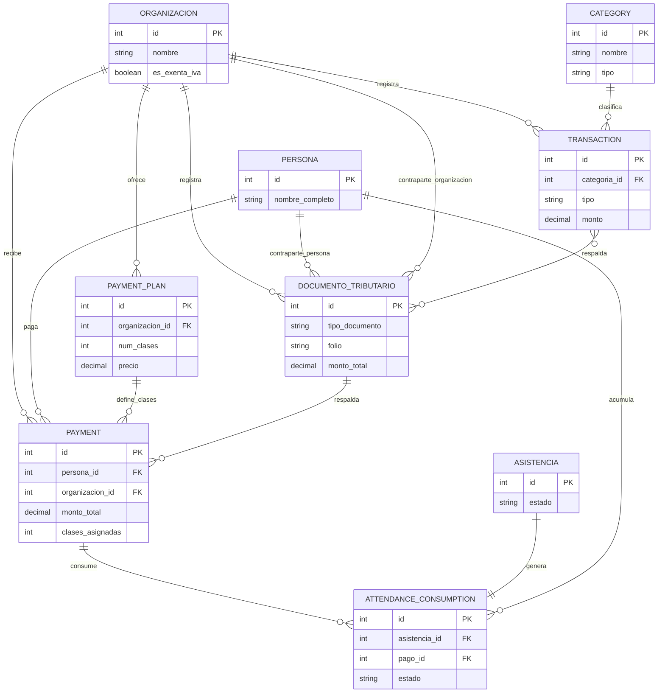
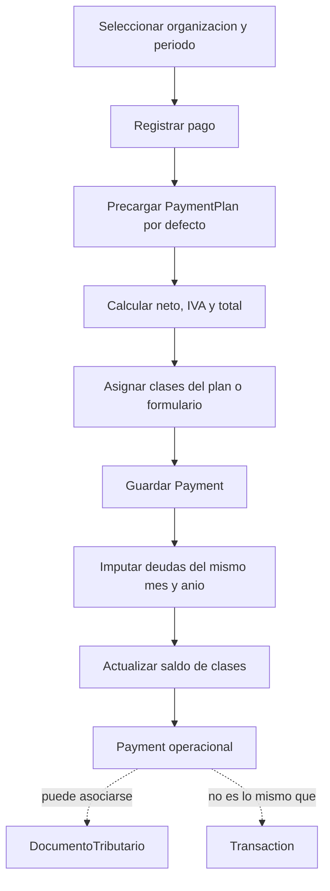
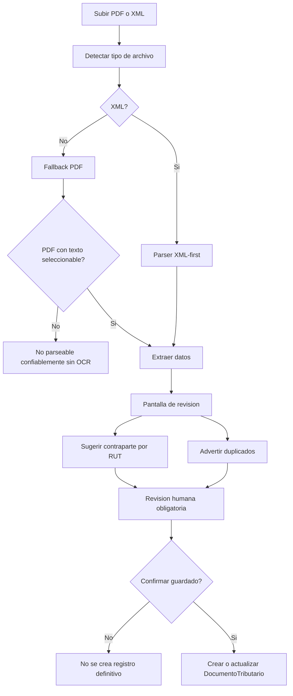
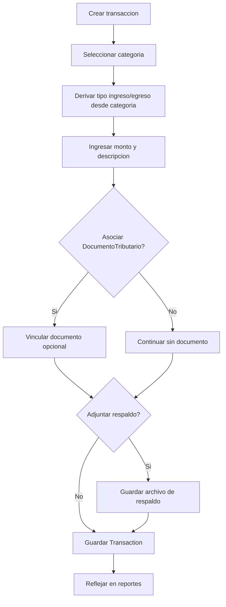

# Finanzas

Fecha de actualizacion: 2026-07-26

## Proposito
La app `finanzas` concentra cobros academicos, documentos tributarios, movimientos de caja y reportes basicos.

Debe servir para operar varias organizaciones y tambien debe poder escalar a finanzas no academicas sin asumir una sola logica de negocio.

## Archivos públicos y protegidos

- Dentro de `MEDIA_ROOT`, solo `organizaciones/logos/` contiene archivos públicos usados directamente por la interfaz.
- `finanzas/documentos/pdf/`, `finanzas/documentos/xml/`, `finanzas/transactions/` y `finanzas/importaciones_tmp/` contienen información protegida.
- Documentos tributarios y respaldos de transacciones se entregan exclusivamente por sus vistas Django autorizadas, con permiso financiero y queryset limitado a la organización activa.
- Las importaciones temporales se entregan por una vista autorizada y por un token almacenado en la sesión Django que realizó la carga.
- Producción no debe exponer directamente `/media/finanzas/` ni servir todo `MEDIA_ROOT` mediante un `alias` general de Nginx. El contrato productivo permite públicamente solo `/media/organizaciones/logos/` y responde `404` para el resto de `/media/`.

## Diagramas

### Modelo Local
Este diagrama muestra las entidades financieras y sus relaciones principales con `personas` y `asistencias`.

### Flujo De Pagos
Este flujo muestra la cobranza operacional. `Payment` no reemplaza a `Transaction` ni a `DocumentoTributario`.

### Flujo De Carga Tributaria Asistida
Este flujo actual conocido exige revision humana: subir un archivo no guarda un documento definitivo.

### Flujo De Transacciones
Este flujo separa el movimiento financiero real de documentos tributarios y pagos operacionales.

## Regla conceptual principal
- `Payment`, `Transaction` y `DocumentoTributario` son entidades separadas.
- `DocumentoTributario` no es obligatorio para que la plataforma funcione.
- El documento tributario actua como respaldo y como ingreso asistido de informacion cuando existe.
- La plataforma debe seguir operando aunque no exista documento tributario.
- Al asociar documentos tributarios a pagos o transacciones, el selector debe respetar organizacion y periodo filtrado.
- En edicion, documentos ya asociados fuera del periodo filtrado siguen visibles para no ocultar datos existentes.
- Si el periodo esta en `Todos`, el selector no filtra por ese componente temporal; si organizacion esta en `Todas`, el POST sigue validando la organizacion seleccionada en el formulario.

## Separacion Contable Y Operacional

### Payment / Pago
`Payment` representa cobranza operacional de clases.

Alimenta:
- estado operacional del estudiante
- clases pagadas
- clases consumidas
- saldo de clases
- deuda por asistencias

No alimenta directamente el libro de caja para evitar doble conteo.

### Transaction / Transaccion
`Transaction` representa el movimiento financiero contable/exportable.

Alimenta:
- libro de caja
- ingresos contables
- egresos contables
- saldo neto del periodo
- reportes por categoria

Regla: el libro de caja usa `Transaction` como unica fuente.

### DocumentoTributario
`DocumentoTributario` es respaldo fiscal/documental.

Puede respaldar:
- pagos operacionales cuando existe documento emitido al estudiante
- transacciones contables cuando existe documento de respaldo

No debe contarse como ingreso o egreso por si solo.

## Panel Financiero Operativo
- El panel financiero expone accesos rapidos para iniciar las tres acciones principales del periodo activo:
  - `Agregar pago`: abre el flujo de `Payment` en `finanzas:pagos_list` con `open=registrar_pago`.
  - `Agregar documento`: usa el flujo existente de importacion/revision de `DocumentoTributario` en `finanzas:documento_tributario_importar`.
  - `Agregar transaccion`: abre el flujo de `Transaction` en `finanzas:transacciones_list` con `open=nueva_transaccion`.
- Los enlaces preservan `periodo_mes`, `periodo_anio` y `organizacion`.
- Los botones solo se muestran a usuarios con permisos mutables del subdominio correspondiente: admin y finanzas.
- Solo lectura puede ver el panel financiero si tiene permiso de lectura, pero no ve accesos mutables.
- Profesor no accede a finanzas completa ni ve acciones financieras.
- Estos accesos no mezclan responsabilidades: crear un `Payment` no crea una `Transaction`, crear una `Transaction` no crea un `Payment`, y un `DocumentoTributario` no se trata como movimiento financiero.

## Libro De Caja
- Fuente unica: `Transaction`.
- Orden de exportacion: `fecha` ascendente + `id` ascendente.
- El CSV bloquea periodos con mes o año en `Todos`; se debe seleccionar un mes y año especificos.
- La columna `Msg` se construye desde datos de la transaccion: fecha, tipo, categoria, descripcion y documentos asociados.
- `Payment` no se exporta en libro de caja salvo que exista una relacion explicita futura con `Transaction`.

### Contrato libro de caja y Msg
- El libro de caja v1.0 usa solo `Transaction` como fuente contable/exportable.
- `Payment` representa cobranza operacional de clases y no alimenta el libro de caja directamente.
- `DocumentoTributario` es respaldo fiscal/documental, no movimiento financiero por si solo.
- El orden estable del CSV es `fecha` ascendente y luego `id` ascendente.
- `numero correlativo` se calcula en la exportacion, parte en 1 y sigue el orden exportado.
- Headers actuales: `numero correlativo`, `fecha`, `tipo`, `categoria`, `descripcion/glosa`, `monto`, `ingreso/egreso`, `documento tributario asociado`, `Msg`.
- `Msg` se arma como texto contable desde `fecha`, tipo de transaccion, categoria, descripcion y documentos asociados.
- El CSV se entrega como UTF-8 con BOM para compatibilidad con Excel/LibreOffice.
- Este contrato no es configurable en v1.0. Se evaluara hacerlo configurable solo si la contadora exige un formato distinto, si Espacio Elementos y Latin Rengo requieren formatos separados, o si aparece una integracion externa real.

## Exportaciones Excel v1.0
- `pagos_alumnos_YYYY_MM.xlsx`: fuente `Payment`; export operacional de cobranza/clases, no ingreso contable.
- `estimacion_pagos_profesores_YYYY_MM.xlsx`: fuente calculada desde sesiones/asistencias y `PersonaRol.valor_clase`/`retencion_sii`; es estimacion operacional, no `Transaction`.
- `transacciones_YYYY_MM.xlsx`: fuente `Transaction`; export contable alineado con libro de caja, sin incluir pagos operacionales directamente.
- Todas las exportaciones respetan periodo y organizacion activa.
- Las exportaciones financieras usan el permiso `exportar_datos`; rol `admin` y rol `finanzas` pueden exportar, profesor y solo lectura no.
- No existe aun una relacion formal `Payment -> Transaction`; por eso los pagos de alumnos no aparecen en transacciones salvo que exista una `Transaction` real creada aparte.
- La estimacion de pagos a profesores no equivale a egreso contable cerrado ni reemplaza una `Transaction`; si se paga efectivamente, debe registrarse como movimiento contable separado.
- Las metricas financieras visibles en la tabla operacional de estudiantes vienen de `Payment` y `AttendanceConsumption`; son cobranza operacional y no deben sumarse al bloque contable.

## Prevencion De Doble Conteo
- El panel separa bloque contable y bloque operacional.
- El bloque contable suma solo `Transaction`.
- El bloque operacional muestra `Payment`, saldos y deuda de clases como informacion de cobranza, no como caja.
- Los documentos tributarios se muestran como respaldo disponible/asociado, no como movimiento financiero.

## Limitaciones Actuales
- No existe relacion directa `Payment -> Transaction`.
- Los pagos de alumnos no generan transacciones automaticamente.
- Los pagos a profesores no tienen modelo contable propio; pueden registrarse como `Transaction` de egreso si corresponde.
- Las alertas de cierre reportan inconsistencias visibles, pero no corrigen datos automaticamente.

## Pago masivo operacional

El registro masivo vive en `finanzas:pagos_masivo` y reutiliza la misma operación de dominio que el pago individual: `Payment.save()` calcula neto, IVA, total y clases; su señal posterior imputa deudas del mismo mes y año. Un `Payment` no crea una `Transaction` automáticamente y el documento tributario sigue siendo opcional.

- La selección se limita a estudiantes con `PersonaRol` activo en la organización autorizada.
- El servidor valida nuevamente personas, planes, documentos, organización y montos al confirmar; la organización enviada por el navegador no es una prueba de permiso.
- El preview no persiste pagos ni efectos financieros.
- La confirmación es `transaction.atomic()`: todas las filas válidas confirman el lote completo; una fila inválida o una excepción deja cero pagos, consumos derivados, auditorías definitivas o lote confirmado.
- `LotePago` conserva UUID, organización, usuario, clave de idempotencia, cantidad, monto total, metadatos mínimos y fecha de confirmación. `Payment.lote` es nullable para preservar pagos históricos e individuales.
- La clave de idempotencia es única en PostgreSQL. Un doble envío devuelve el lote ya confirmado y no crea pagos adicionales.
- La auditoría registra el lote y cada pago con origen `pago_masivo`, sin guardar archivos binarios ni el payload completo del navegador.
- El flujo individual y el masivo no generan `Transaction`; la conciliación contable de pagos operacionales sigue siendo una decisión pendiente separada.
- El flujo actual de `Payment` no admite archivo de respaldo binario. No se duplica ni se expone un archivo común; los documentos tributarios se asocian por organización y continúan protegidos por sus vistas autorizadas.

La deuda pendiente de cierre transversal de permisos de Personas y Finanzas, incluido el bypass histórico de `is_staff` en consumidores antiguos, no queda resuelta por este flujo.

## Decisiones Pendientes
- Definir si un `Payment` debe crear o sugerir una `Transaction` en un flujo futuro.
- Definir conciliacion formal entre pagos operacionales, cartola bancaria y transacciones.
- Definir reglas de categorias contables obligatorias para libro de caja.

## Modelo funcional vigente
- `Payment`: cobro academico a estudiante por clases o planes.
- `Transaction`: movimiento real de dinero, ingreso o egreso, con respaldo bancario o de caja.
- `DocumentoTributario`: documento fiscal opcional, con PDF/XML, montos, tasas y asociaciones.
- `Category`: clasificacion de transacciones para reportes.
- `PaymentPlan`: estructura comercial de clases y precio.
- Los modelos financieros viven en `finanzas.models`; no deben depender de namespaces legacy.

## Subdominios internos
`finanzas` contiene por ahora dos subdominios distintos.

### Cobranza operacional
Incluye:
- `PaymentPlan`
- `Payment`
- `AttendanceConsumption`
- imputacion de pagos contra asistencias
- deuda por clases
- saldo de clases

Responde preguntas como:
- quien debe clases
- quien pago
- cuantas clases quedan disponibles
- que asistencia fue consumida por que pago

### Finanzas / contabilidad
Incluye:
- `DocumentoTributario`
- `Transaction`
- `Category`
- reportes financieros
- respaldos para contadora

Responde preguntas como:
- que ingreso o egreso existio
- que documento tributario respalda una operacion
- que categoria contable corresponde
- que informacion necesita la contadora

Regla:
- Cobranza operacional puede alimentar finanzas/contabilidad, pero no debe mezclarse con parsing tributario ni conciliacion contable dentro de views.

## Reglas de uso
- Un ingreso puede existir como `Transaction` y tambien como `DocumentoTributario`, pero cada entidad cumple un rol distinto.
- Una boleta de venta puede sugerir un `Payment`, pero no debe fusionarse con el pago.
- Una boleta de honorarios puede respaldar un egreso, pero no reemplaza la `Transaction`.
- El archivo adjunto de una `Transaction` corresponde al respaldo del movimiento, por ejemplo transferencia o cartola.
- El PDF/XML tributario vive en `DocumentoTributario`.
- Las asociaciones entre entidades deben poder hacerse manualmente.
- Un `DocumentoTributario` puede asociarse opcionalmente a una `Persona` o a una `Organizacion` como contraparte, pero no a ambas al mismo tiempo.
- Cada organizacion debe tener un solo `PaymentPlan` por defecto.
- El primer plan creado en una organizacion queda por defecto automaticamente.
- El plan por defecto se puede cambiar desde gestion de planes y es el que aparece preseleccionado al registrar un nuevo pago.
- Al registrar un nuevo pago, el checkbox `aplica IVA` debe precargarse segun `Organizacion.es_exenta_iva`: organizaciones exentas parten sin IVA, las demas con IVA activo.
- Al registrar correctamente un pago, el redirect conserva los filtros vigentes y elimina `open=registrar_pago`; ante errores de validacion, el modal permanece abierto con el formulario ligado y sus errores.
- Al editar un pago desde modal, el parametro `editar_pago` solo debe usarse para abrir el modal. Al cancelar, cerrar o guardar correctamente, la URL debe volver al listado preservando filtros, pero sin `editar_pago`, para evitar que el modal se reabra.
- Al editar una transaccion, el campo HTML de fecha debe precargar el valor persistido en formato `YYYY-MM-DD` y conservar el valor enviado cuando el formulario es invalido.
- Un pago no se elimina desde la aplicación. La acción disponible es una reversa controlada que conserva el registro, exige motivo, guarda autor y fecha, mantiene la organización y rechaza una segunda reversa.
- Solo administración autorizada de la organización puede revertir pagos; finanzas, profesoras y otras organizaciones no pueden hacerlo.
- Un pago revertido se muestra como histórico, no otorga clases y se excluye de saldos, totales y reportes operacionales vigentes.
- Al revertir un pago, sus consumos se recalculan: se reasignan a otro derecho válido del mismo periodo o quedan como deuda.
- Pago, plan y clase deben corresponder al mismo mes y año. Las clases pagadas no se arrastran entre meses, no se recuperan en el mes siguiente y no existe vigencia móvil de 30 días.
- `PRESENTE`, `AUSENTE` y `JUSTIFICADA` consumen un derecho mensual cuando existe; si no existe pago válido con saldo, generan `DEUDA`.
- Una ausencia o justificación conserva su significado académico, pero no recupera el cupo financiero.
- `PENDIENTE` queda reservado para excepciones explícitas que no consumen ni generan deuda, como una clase liberada activa.
- Un pago asociado a plan solo otorga derecho si la fecha de la clase está dentro de `fecha_inicio` y `fecha_fin` cuando esos límites existen. Un pago directo sin plan conserva el derecho por sus clases asignadas.
- Eliminar una asistencia elimina en cascada su único consumo y vuelve a disponibilizar ese cupo en el pago.
- Varios consumos pueden compartir un `Payment` mientras el total no supere `clases_asignadas`; compartirlo no constituye por sí mismo una inconsistencia.
- Las promociones se administran ajustando manualmente `clases_asignadas`. No existe modelo, detección ni duplicación automática de cupos promocionales.

## Reconciliación de integridad

`python manage.py reconciliar_integridad_dominio` ejecuta un diagnóstico de solo lectura.

Detecta por separado consumos fuera del periodo mensual, consumos sin pago, sobreconsumo respecto de `clases_asignadas`, duplicados reales, clases liberadas consumiendo, cruces de organización o persona, pagos revertidos todavía imputados, planes fuera de vigencia y estados incompatibles. La salida contiene conteos e identificadores técnicos; devuelve error si encuentra problemas y nunca repara datos.

Los datos históricos fuera de regla se regularizan manualmente por el gestor. El diagnóstico no separa pagos, reasigna consumos, modifica cupos ni repara registros.
- Si luego aparece un pago, solo puede imputar deudas del mismo mes y anio.

## Carga asistida de documentos
Estado actual:
- XML-first
- soporte inicial para DTE XML clasico
- soporte inicial para boleta de honorarios XML
- PDF fallback basico
- parser PDF con mejora especifica para boletas de honorarios electronicas
- parser PDF con mejora especifica para boletas de venta electronicas tipo 39 y 41 cuando vienen con `BOLETA ELECTRONICA NUMERO` o `BOLETA EXENTA ELECTRONICA NUMERO`, `Medio de pago`, glosa libre y monto total
- pantalla de revision antes del guardado
- la pantalla de revision incluye visor inline del PDF/XML temporal para contrastar el formulario contra el archivo original
- si no hay libreria Python para leer PDF, se intenta `pdftotext` del sistema
- el fallback PDF funciona sobre PDFs con texto seleccionable; no resuelve escaneos sin OCR

Reglas:
- subir un archivo no debe guardar automaticamente registros finales
- el flujo debe ser:
  - subir archivo
  - extraer datos
  - mostrar formularios precargados
- revisar/corregir
- confirmar guardado
- la UI de carga asistida usa un solo input de archivo; el backend detecta internamente si el archivo subido es XML o PDF
- la deteccion de duplicados es advertencia, no bloqueo automatico
- la unicidad operativa de un documento tributario dentro de una organizacion se define por `tipo_documento + folio + rut_emisor`; el folio por si solo no basta, porque distintos emisores pueden repetirlo
- los datos extraidos desde PDF tienen menor confianza y deben revisarse siempre
- en facturas y boletas, un monto con punto de miles como `500.000` significa `500000` sin decimales; esa normalizacion aplica tanto al parser PDF como a la confirmacion manual de la carga asistida
- en boletas de venta electronicas PDF tipo 39 y 41, el parser debe extraer al menos:
  - folio completo desde `BOLETA ELECTRONICA NUMERO`
  - fecha
  - medio de pago
  - glosa principal
  - monto bruto
- para tipo 39 afecta:
  - IVA incluido
  - neto calculado como `bruto - IVA`
- para tipo 41 exenta:
  - `exento = bruto`
  - `IVA = 0`
  - `neto = 0`
- en esas boletas, el pago sugerido debe heredar el metodo de pago desde el documento cuando venga indicado, por ejemplo `Transferencia Electronica`
- en la carga asistida, `observaciones` debe precargarse con la glosa o descripcion principal extraida del documento, antes que con warnings tecnicos
- la pantalla de revision de carga asistida debe mostrar errores generales del formulario cuando el guardado no puede confirmarse
- las vistas de crear/editar documentos tributarios deben mostrar un error legible si la base rechaza el guardado por un conflicto de unicidad, en vez de exponer un `IntegrityError`
- en la carga asistida, se debe sugerir automaticamente la contraparte del documento comparando el RUT de la contraparte real contra personas y organizaciones existentes; la sugerencia siempre debe poder cambiarse manualmente antes de guardar

## UI y navegacion
- Todas las vistas de `finanzas` deben mantener `periodo_mes`, `periodo_anio` y `organizacion`.
- El contexto global de filtros, persona navegante y organizacion activa debe importarse desde `plataformaelemental.context`, no desde `asistencias.views`.
- Si no hay filtros explicitos en la URL, el periodo global debe partir en el mes y año actuales, y la organizacion debe partir en `Todas`.
- Los filtros globales de `mes`, `anio` y `organizacion` deben autoaplicarse al cambiar, sin boton `Aplicar filtros`.
- `periodo_mes` y `periodo_anio` deben ofrecer la opcion `Todos`, permitiendo ver todos los meses de un año, un mismo mes en todos los años o todo el historial, segun combinacion.
- El sidebar agrupa visualmente los accesos principales, manteniendo `panel`, `pagos`, `documentos tributarios`, `transacciones`, `planes` y `categorias`.
- Cada vista principal y de detalle debe tener su ayuda breve accesible desde un icono junto al titulo; en desktop se muestra como tooltip al pasar el mouse y en mobile como popover al tocar, en vez de ocupar un cuadro adicional dentro de la vista.
- Los botones de accion en `finanzas` deben llevar icono representativo a la izquierda y `title` descriptivo; en desktop muestran icono y texto, y en mobile conservan solo el icono para ahorrar espacio.
- Botones de crear/agregar en verde.
- Botones de eliminar en rojo.

## Cambios ya implementados
- Resumen superior en `pagos` con total pagos, total clases pagadas, IVA total y saldo.
- Resumen superior en `documentos tributarios` y `transacciones` usando el mismo universo filtrado del listado; en documentos separa `ingresos` y `egresos` segun si la organizacion del documento actua como emisor o receptor, y ademas muestra `IVA` y `retencion`.
- Los cards de resumen en `pagos`, `transacciones` y panel deben usar colores suaves y consistentes entre vistas, evitando fondos saturados.
- Las vistas principales que crean contenido en `finanzas` deben mostrar el boton de alta al nivel del titulo y abrir el formulario en modal, para no desplazar el listado principal.
- En `pagos`, la edicion tambien debe resolverse dentro del listado mediante modal, y al guardar debe volver al mismo listado filtrado en vez de abrir una pantalla aparte.
- En `pagos`, al cerrar el modal de edicion con cancelar, equis o click fuera, la URL debe eliminar `editar_pago` del querystring para que un refresh no reabra el modal.
- En `pagos`, debe existir tambien un alta rapida de `Nueva persona` junto a `Registrar pago`, en modal, usando la organizacion filtrada arriba para asignar automaticamente el rol `ESTUDIANTE`.
- Si no hay organizacion filtrada al usar `Nueva persona` desde `pagos`, el error debe aparecer dentro del modal indicando que primero se seleccione una organizacion.
- El listado de `documentos tributarios` prioriza lectura financiera/tributaria: muestra `neto`, `exento`, `IVA`, `retencion` y `total`, y no repite `organizacion` porque ya existe filtro superior.
- `documentos tributarios` debe permitir asociar contraparte tanto en alta manual como en carga asistida y edicion posterior; el detalle y listado deben mostrar esa asociacion cuando exista.
- `reporte categorias` muestra tabla y grafico de torta sobre el mismo consolidado filtrado.
- Listado de `pagos` con badge fiscal `Afecta/Exenta`, columnas separadas de neto, IVA y bruto, y accion rapida para copiar descripcion operativa del pago.
- Los montos de neto, IVA y bruto en `pagos` son clickeables y copian el valor sin formato al portapapeles.
- La descripcion operativa del pago usa como disciplina principal aquella donde la persona registra mas asistencias `presente`.
- En transacciones, el tipo `ingreso/egreso` se deriva automaticamente desde la categoria y no se expone como selector manual.
- En transacciones, el selector de documentos tributarios muestra tipo, folio y extracto de observaciones para dar contexto antes de asociar.
- Al crear una transaccion nueva, la organizacion debe quedar precargada desde el filtro superior activo.
- Filtro de planes por organizacion en el formulario de pagos.
- Gestion de planes con marca `por defecto` por organizacion y precarga automatica en el alta de pagos.
- `finanzas/planes/<id>/editar` reutiliza el mismo listado de planes y abre una edicion inline dentro de la tabla, en vez de navegar a una pantalla separada.
- Los querysets y agregaciones de lectura para planes, pagos, documentos tributarios, transacciones, panel, categorias y exportaciones viven en `finanzas/selectors.py`; las views no deben volver a concentrar esos calculos si solo leen datos.
- Los helpers de contexto base, ayudas UI, URLs con querystring, redirects con querystring, clasificacion visual de archivos y error legible por conflicto de documento viven en `finanzas/forms_helpers.py`.
- `finanzas.services` es un paquete; la imputacion de pagos y consumos vive en `finanzas/services/imputacion.py`, y `finanzas/services/__init__.py` reexporta la API publica historica para mantener imports existentes.
- La logica operacional de pagos que no depende de documentos tributarios vive en `finanzas/services/pagos.py`: alta rapida de estudiante desde pagos, enriquecimiento de filas del listado, texto copiable, resumen de consumos y saldo de clases.
- La logica de armado de reportes y exportaciones vive en `finanzas/services/reportes.py`: contexto final del panel financiero, contexto del reporte de categorias y filas CSV de pagos/transacciones. Las queries puras siguen en `finanzas/selectors.py`.
- Boton volver en editar pago prioriza la pagina anterior.
- Visor embebido en detalle de transacciones para PDF e imagenes; otros archivos siguen abriendose externamente.
- Separacion clara entre `Documentos tributarios` y `Transacciones`.
- Carga asistida tributaria con parseo, revision y confirmacion.
- Integracion asistencia-pagos restringida al mismo mes de la clase y del pago.

## Pendientes
- Mejorar parser PDF para mas formatos y layouts.
- Importacion directa desde SII.
- Matching mejor de contraparte.
- Flujo de conciliacion mas asistido entre pagos, documentos y transacciones.
- Evaluar una entidad superior de evento/proyecto si el control financiero por presentacion se vuelve necesario.

## Corte de refactor financiero
Se completo una primera separacion interna de `finanzas`:
- selectors de lectura en `finanzas/selectors.py`
- helpers UI/form en `finanzas/forms_helpers.py`
- imputacion en `finanzas/services/imputacion.py`
- pagos operacionales en `finanzas/services/pagos.py`
- reportes/exportaciones en `finanzas/services/reportes.py`

Queda pendiente, no urgente:
- extraer helpers puros de documentos tributarios
- extraer flujo de importacion tributaria por etapas
- evaluar constraints de integridad
- separar CI de deploy productivo cuando produccion migre a PostgreSQL

## API
La API de datos de `finanzas` queda desactivada en v1.0.

Motivo:
- no existe consumidor real actual
- reduce riesgo de exposicion de pagos, documentos tributarios y transacciones
- evita mantener endpoints "por si acaso"

La salida contable/operacional vigente se hace por vistas HTML y exportaciones controladas por permisos.
