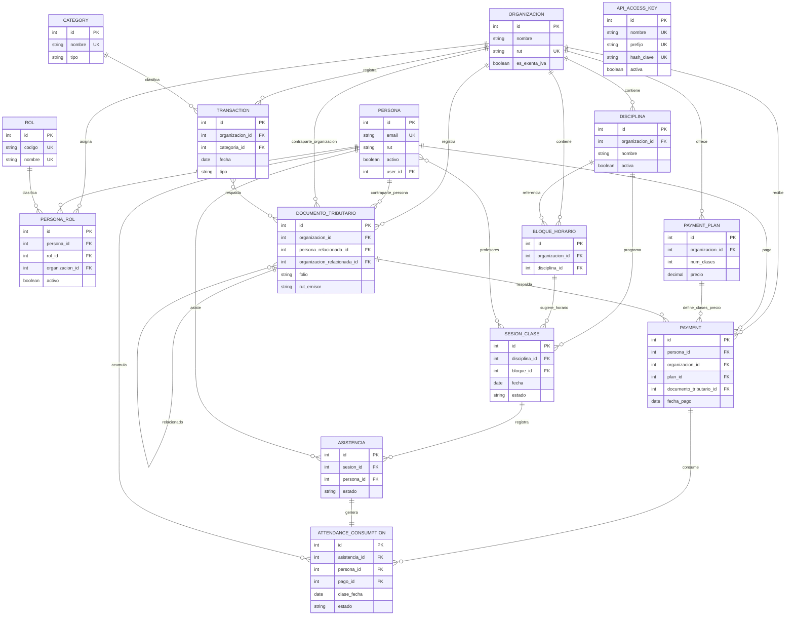

# Modelo De Datos

Fecha de actualizacion: 2026-05-11

## Proposito
Este documento resume el mapa relacional vigente de Plataforma Elemental.

Sirve como referencia antes de tocar modelos, migraciones, reglas de imputacion o relaciones entre apps.

## Mapa ER Simplificado
Este diagrama muestra las entidades principales por dominio y sus relaciones transversales. `ApiAccessKey` no tiene FK directa con usuarios o personas; se modela como credencial de lectura validada por hash.

## Entidades Principales

### Personas
- `Organizacion`: entidad operativa o fiscal. Tiene RUT unico y configuracion de exencion IVA.
- `Persona`: identidad individual. Tiene email unico opcional, RUT opcional validado y relacion opcional con `User`.
- `Rol`: catalogo de roles como estudiante o profesor.
- `PersonaRol`: une persona, rol y organizacion. Guarda configuracion operativa por rol, como `valor_clase` y `retencion_sii`.

### Asistencias
- `Disciplina`: actividad dictada dentro de una organizacion.
- `BloqueHorario`: horario recurrente opcionalmente asociado a disciplina.
- `SesionClase`: clase concreta en una fecha, con disciplina, bloque opcional, profesores y estado.
- `Asistencia`: registro de persona en una sesion, con estado presente, ausente o justificada.

### Finanzas
- `PaymentPlan`: plan comercial por organizacion, con clases y precio.
- `Payment`: pago operacional de clases asociado a persona, organizacion, plan y opcionalmente documento tributario.
- `AttendanceConsumption`: imputacion financiera de una asistencia contra un pago o deuda.
- `DocumentoTributario`: snapshot fiscal con folio, emisor, receptor, montos, archivos, metadata y contraparte opcional.
- `Category`: categoria contable para transacciones.
- `Transaction`: movimiento financiero de ingreso o egreso, asociado a categoria, organizacion y documentos tributarios opcionales.

## Tablas Legacy

`database` queda como namespace legado de migraciones y compatibilidad historica.

Reglas:
- No recibe modelos nuevos.
- No debe contener logica de negocio nueva.
- No debe ser importado por apps funcionales para resolver dominio.
- Sigue existiendo porque migraciones historicas de `personas`, `asistencias` y `finanzas` todavia dependen de nodos de migracion `database`.

Estado actual:
- `database/models.py` funciona como capa de compatibilidad que reexporta modelos reales desde apps duenias.
- La eliminacion completa de `database` requiere limpiar o reescribir dependencias de migraciones, no solo borrar la carpeta.

## Relaciones Criticas

### Identidad y organizaciones
- `PersonaRol` es la relacion central entre `Persona`, `Rol` y `Organizacion`.
- La misma persona puede tener roles distintos en organizaciones distintas.
- La configuracion economica del profesor vive en `PersonaRol`, no en `Persona`, porque depende de persona + organizacion.

### Asistencia academica
- `SesionClase` pertenece a una `Disciplina`.
- `SesionClase` puede tener muchos profesores mediante many-to-many con `Persona`.
- `Asistencia` une una `Persona` con una `SesionClase`.
- Solo debe existir una asistencia por persona y sesion.

### Cobranza operacional
- `Payment` pertenece a una `Persona` estudiante y a una `Organizacion`.
- `Payment` puede venir de un `PaymentPlan`.
- `AttendanceConsumption` une una `Asistencia` con el estado financiero de esa clase.
- `AttendanceConsumption.pago` puede ser `NULL` si la asistencia esta pendiente o como deuda.
- Una asistencia solo puede tener un consumo financiero.

### Documentos tributarios
- `DocumentoTributario.organizacion` representa la organizacion bajo la cual se registra el documento.
- `DocumentoTributario.persona_relacionada` y `DocumentoTributario.organizacion_relacionada` representan contraparte interna opcional.
- `DocumentoTributario.documento_relacionado` permite notas u otros documentos vinculados.
- `Payment.documento_tributario` permite respaldar un pago operacional.
- `Transaction.documentos_tributarios` permite asociar uno o mas respaldos tributarios a un movimiento.

## Reglas De Integridad

### Unicidades
- `Organizacion.rut` es unico.
- `Persona.email` es unico, pero opcional.
- `Rol.nombre` y `Rol.codigo` son unicos.
- `PersonaRol` es unico por `persona + rol + organizacion`.
- `Disciplina` es unica por `organizacion + nombre + nivel`.
- `Asistencia` es unica por `sesion + persona`.
- `PaymentPlan` es unico por `organizacion + nombre`.
- `DocumentoTributario` es unico por `organizacion + tipo_documento + folio + rut_emisor`.

### Cascadas
- Si se elimina una `Organizacion`, se eliminan sus roles asignados, disciplinas, bloques, planes, pagos, documentos y transacciones asociados por `CASCADE`.
- Si se elimina una `Persona`, se eliminan sus roles, asistencias y consumos por `CASCADE`.
- Si se elimina una `SesionClase`, se eliminan sus asistencias por `CASCADE`.
- Si se elimina una `Asistencia`, se elimina su `AttendanceConsumption` por `CASCADE`.

### Protecciones
- `PersonaRol.rol` usa `PROTECT`, por lo que no se puede eliminar un rol usado.
- `Payment.persona` usa `PROTECT`, por lo que no se puede eliminar una persona con pagos.
- `Transaction.categoria` usa `PROTECT`, por lo que no se puede eliminar una categoria con transacciones.

### SET_NULL
- `BloqueHorario.disciplina` queda en `NULL` si se elimina la disciplina.
- `SesionClase.bloque` queda en `NULL` si se elimina el bloque horario.
- `Payment.plan` queda en `NULL` si se elimina el plan.
- `Payment.documento_tributario` queda en `NULL` si se elimina el documento.
- `AttendanceConsumption.pago` queda en `NULL` si se elimina el pago.
- `DocumentoTributario.documento_relacionado` queda en `NULL` si se elimina el documento padre.
- `DocumentoTributario.persona_relacionada` queda en `NULL` si se elimina la persona relacionada.
- `DocumentoTributario.organizacion_relacionada` queda en `NULL` si se elimina la organizacion relacionada.

## Datos Que Se Duplican A Proposito

- `DocumentoTributario` guarda nombres, RUT, montos y metadata como snapshot fiscal aunque exista `Persona` u `Organizacion`.
- `Payment` guarda montos neto, IVA y total calculados al momento del pago.
- `AttendanceConsumption` guarda `persona` y `clase_fecha` aunque esos datos tambien se puedan derivar desde `Asistencia`; esto facilita consultas de deuda/saldo por periodo.

Regla:
- La duplicacion es aceptable cuando conserva historia fiscal u operacional.
- Si un dato duplicado se usa como fuente de verdad mutable, debe existir una regla explicita y test.

## Deuda Tecnica De Modelo

- `database` sigue instalado por compatibilidad historica de migraciones; eliminarlo requiere refactor de grafo de migraciones.
- `database/models.py` reexporta modelos reales y puede inducir imports incorrectos si no se controla.
- `DocumentoTributario` permite `persona_relacionada` y `organizacion_relacionada`; debe mantenerse la regla de no asociar ambas a la vez desde formularios/servicios.
- `Payment`, `Transaction` y `DocumentoTributario` estan relacionados, pero todavia no existe una entidad superior de conciliacion.
- La frontera entre cobranza operacional y contabilidad vive dentro de `finanzas`; debe seguir separandose con selectors/services antes de crecer mas.
- Algunas reglas de integridad aun dependen de services/forms en vez de constraints de base de datos.

## Antes De Tocar Modelos

Checklist minimo:
- Revisar este documento.
- Revisar el `.md` de la app duena.
- Revisar migraciones existentes y dependencias con `database`.
- Ejecutar `python manage.py makemigrations --check --dry-run`.
- Ejecutar tests relevantes, especialmente si cambia `Payment`, `AttendanceConsumption`, `Asistencia`, `PersonaRol` o `DocumentoTributario`.
