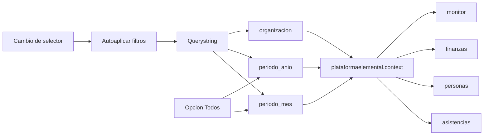
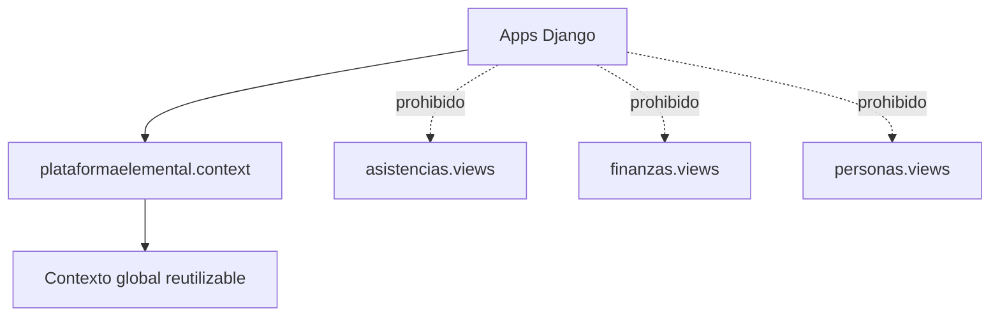

# Navegacion Y Contexto Global

Fecha de actualizacion: 2026-05-11

## Proposito
Este documento concentra las reglas transversales de navegacion, periodo, organizacion activa y contexto global de UI.

Aplica a:
- `asistencias`
- `finanzas`
- `personas`
- `monitor`, cuando consuma filtros globales

## Filtros globales
Los filtros globales son:
- `periodo_mes`
- `periodo_anio`
- `organizacion`

Este diagrama muestra como los filtros se propagan desde el querystring al contexto neutral y luego a las apps consumidoras.



Reglas:
- Deben mantenerse en toda la navegacion entre apps.
- Si no existe filtro explicito en la URL, `periodo_mes` y `periodo_anio` parten en la fecha actual.
- Si no existe filtro explicito de organizacion, `organizacion` parte en `Todas`.
- Los selectores deben autoaplicarse al cambiar; no usan boton `Aplicar filtros`.
- `periodo_mes` y `periodo_anio` aceptan la opcion `Todos`.
- El sistema debe soportar filtros parciales:
  - todos los meses de un anio
  - un mismo mes en todos los anios
  - todo el historial

## Contexto compartido
La logica compartida de UI, periodo, organizacion activa y navegacion vive en:

```text
plataformaelemental.context
```

Reglas:
- Ninguna app debe importar helpers desde `asistencias.views`, `finanzas.views` ni `personas.views`.
- Las apps pueden consumir contexto global desde el modulo neutral.
- Si se agrega un nuevo filtro global, debe actualizarse este documento y los tests relevantes.

Este diagrama marca la dependencia permitida y las dependencias prohibidas.



## Barra de apps
La barra compartida debe mantener enlaces a:
- `asistencias`
- `finanzas`
- `personas`
- `monitor`

Reglas:
- Los enlaces deben arrastrar los filtros globales activos.
- El objetivo es continuidad operativa, no navegacion aislada por app.
- En mobile puede cambiar la disposicion visual, pero debe conservar la misma necesidad funcional.

## Responsabilidad por capa
- El modulo neutral arma contexto global reutilizable.
- Las views leen request, combinan contexto global con contexto local y renderizan.
- Los templates muestran filtros y enlaces, pero no calculan reglas de negocio.
- Los services/selectors no deben depender de detalles visuales de la barra de navegacion.

## Relacion con apps
- Las reglas visuales especificas de `finanzas` viven en [docs/apps/FINANZAS.md](../apps/FINANZAS.md).
- Las reglas visuales especificas de `asistencias` viven en [docs/apps/ASISTENCIAS.md](../apps/ASISTENCIAS.md).
- Las reglas visuales especificas de `personas` viven en [docs/apps/PERSONAS.md](../apps/PERSONAS.md).
