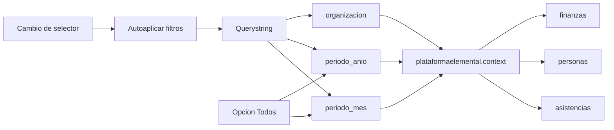
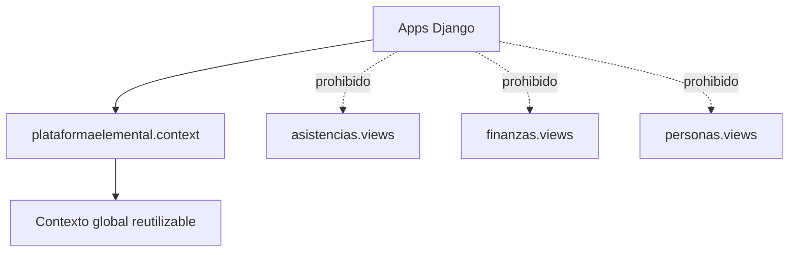

# Navegacion Y Contexto Global

Fecha de actualizacion: 2026-09-11

## Proposito
Este documento concentra las reglas transversales de navegacion, periodo, organizacion activa y contexto global de UI.

Aplica a:
- `asistencias`
- `finanzas`
- `personas`

## Filtros globales
Los filtros globales son:
- `periodo_mes`
- `periodo_anio`
- `organizacion`

Este diagrama muestra como los filtros se propagan desde el querystring al contexto neutral y luego a las apps consumidoras.


```mermaid
flowchart LR
    A["Querystring"] --> B["periodo_mes"]
    A --> C["periodo_anio"]
    A --> D["organizacion"]
    B --> E["plataformaelemental.context"]
    C --> E
    D --> E
    E --> F["asistencias"]
    E --> G["personas"]
    E --> H["finanzas"]
    J["Cambio de selector"] --> K["Autoaplicar filtros"]
    K --> A
    L["Opcion Todos"] --> B
    L --> C
```

Reglas:
- Deben mantenerse en toda la navegacion entre apps.
- Si no existe filtro explicito en la URL, `periodo_mes` y `periodo_anio` parten en la fecha actual.
- En las superficies administrativas, si no existe filtro explícito de
  organización, `organizacion` parte en `Todas`.
- En modo Profesor no existe fallback: `/profesor/` sin organización es
  únicamente una pantalla de selección sin datos operativos. El resto exige
  `?organizacion=<id>` o `?organizacion=todos`; el segundo valor agrega solo los
  roles `PROFESOR` activos del usuario y es estrictamente de lectura.
- La selección de Profesor se conserva en enlaces, formularios, AJAX, detalle
  de sesión y navegación consecutiva. Es contexto de navegación, no permiso:
  el recurso debe seguir perteneciendo a esa organización y a una asignación
  docente operativa.
- La ausencia de asignación docente no oculta una organización autorizada del
  selector, pero deshabilita su superficie mutante y hace que las rutas directas
  de operación respondan `403`.
- Profesor usa exactamente uno de estos contratos temporales:
  `periodo_mes=<1..12>&periodo_anio=<YYYY>` o `periodo=todos`. Falta de uno de
  los componentes, combinación de ambos o valores fuera de rango producen
  `404`. `periodo=todos` pagina el historial de sesiones y pagos en bloques de
  25 y también bloquea mutaciones.
- Organización, período y tema viven en la hoja inferior “Contexto de trabajo”.
  La aplicación es explícita y siempre vuelve a Inicio; así no se trasladan IDs
  o formularios pertenecientes a otro contexto. El tema se guarda en
  `localStorage`, nunca como permiso o dato de dominio.
- Los selectores deben autoaplicarse al cambiar; no usan boton `Aplicar filtros`.
- `periodo_mes` y `periodo_anio` aceptan la opcion `Todos`.
- El sistema debe soportar filtros parciales:
  - todos los meses de un anio
  - un mismo mes en todos los anios
  - todo el historial

## Contexto compartido
La logica compartida de UI, periodo, organizacion activa y navegacion vive en:

```text
plataformaelemental.context
```

Reglas:
- Ninguna app debe importar helpers desde `asistencias.views`, `finanzas.views` ni `personas.views`.
- Las apps pueden consumir contexto global desde el modulo neutral.
- Si se agrega un nuevo filtro global, debe actualizarse este documento y los tests relevantes.

Este diagrama marca la dependencia permitida y las dependencias prohibidas.


```mermaid
flowchart TD
    A["Apps Django"] --> B["plataformaelemental.context"]
    A -. "prohibido" .-> C["asistencias.views"]
    A -. "prohibido" .-> D["finanzas.views"]
    A -. "prohibido" .-> E["personas.views"]
    B --> F["Contexto global reutilizable"]
```

## Navegacion principal
La navegacion principal debe mantener enlaces activos a:
- `asistencias`
- `finanzas`
- `personas`

Reglas:
- Los enlaces deben arrastrar los filtros globales activos.
- El objetivo es continuidad operativa, no navegacion aislada por app.
- En mobile puede cambiar la disposicion visual, pero debe conservar la misma necesidad funcional.
- En el sidebar administrativo, los dominios son encabezados de agrupación y
  las páginas son los destinos navegables. `Panel` sigue siendo un destino
  explícito; el encabezado no combina la semántica de título y enlace.
- La página exacta usa `aria-current="page"`; el dominio activo aporta contexto
  visual, pero no reemplaza esa identificación.
- En desktop, el sidebar se puede contraer a un rail de accesos primarios. La
  preferencia vive en `localStorage`, no en el modelo de usuario. El control
  conserva nombre accesible, `aria-expanded`, objetivo de 44 px y disponibilidad
  durante el desplazamiento. El rail conserva nombres accesibles, ubicación de
  dominio y badges operacionales.
- El dominio dueño de la operación académica se rotula `Sesiones` en la
  navegación; `asistencias` permanece como nombre técnico de app, rutas y
  modelos.

## Dashboard General

La ruta `/` compone bloques de lectura mediante
`plataformaelemental.dashboard`. Cada bloque determina primero las organizaciones
para las que el usuario posee la capacidad correspondiente y solo después
ejecuta sus consultas.

Los roles organizacionales no reciben agregados ni enlaces operativos cuando el
contexto está en `Todas`: las vistas de destino exigen una organización concreta
y la portada no elige una silenciosamente. Staff y superusuarios conservan el
agregado global porque sus decoradores permiten ese alcance.

Fuentes y semántica iniciales:

| Indicador | Fuente | Período | Organización | Semántica |
| --- | --- | --- | --- | --- |
| Sesiones completadas | `SesionClase.COMPLETADA` | `fecha` | disciplina | sesiones cerradas |
| Personas con asistencia registrada | `Asistencia.persona` distinta | `sesion.fecha` | disciplina | incluye cualquier estado de asistencia |
| Clases en deuda | `AttendanceConsumption.DEUDA` | `clase_fecha` | asistencia/sesión/disciplina | no incluye `PENDIENTE` |
| Ingresos contables | `Transaction.INGRESO` | `fecha` | transacción | no suma `Payment` ni documentos |

Cada KPI y su detalle reutilizan los mismos selectores internos de período y
alcance. Las rutas `/resumen/<indicador>/` no reinterpretan la cifra: paginan el
conjunto que la compone. En ingresos, el encabezado conserva la suma monetaria y
la tabla enumera sus transacciones; en personas, el valor es la cantidad de
personas únicas y cada fila informa cuántos registros aportó.

`Clases disponibles` no forma parte de esta entrega: existe diferencia entre
saldo por pago y agregaciones acotadas al período. Incorporarlo exige fijar antes
la pregunta temporal y extraer una regla canónica.

La búsqueda de personas parte de un queryset previamente acotado por capacidad
y organización. El helper de texto no concede acceso. El resultado individual
presenta registros de asistencia, pagos operacionales, monto pagado y clases en
deuda del contexto; no los convierte en participación, ingreso contable ni saldo.

## Responsabilidad por capa
- El modulo neutral arma contexto global reutilizable.
- Las views leen request, combinan contexto global con contexto local y renderizan.
- Los templates muestran filtros y enlaces, pero no calculan reglas de negocio.
- Los services/selectors no deben depender de detalles visuales de la barra de navegacion.

## Relacion con apps
- Las reglas visuales especificas de `finanzas` viven en [docs/apps/FINANZAS.md](../apps/FINANZAS.md).
- Las reglas visuales especificas de `asistencias` viven en [docs/apps/ASISTENCIAS.md](../apps/ASISTENCIAS.md).
- Las reglas visuales especificas de `personas` viven en [docs/apps/PERSONAS.md](../apps/PERSONAS.md).
