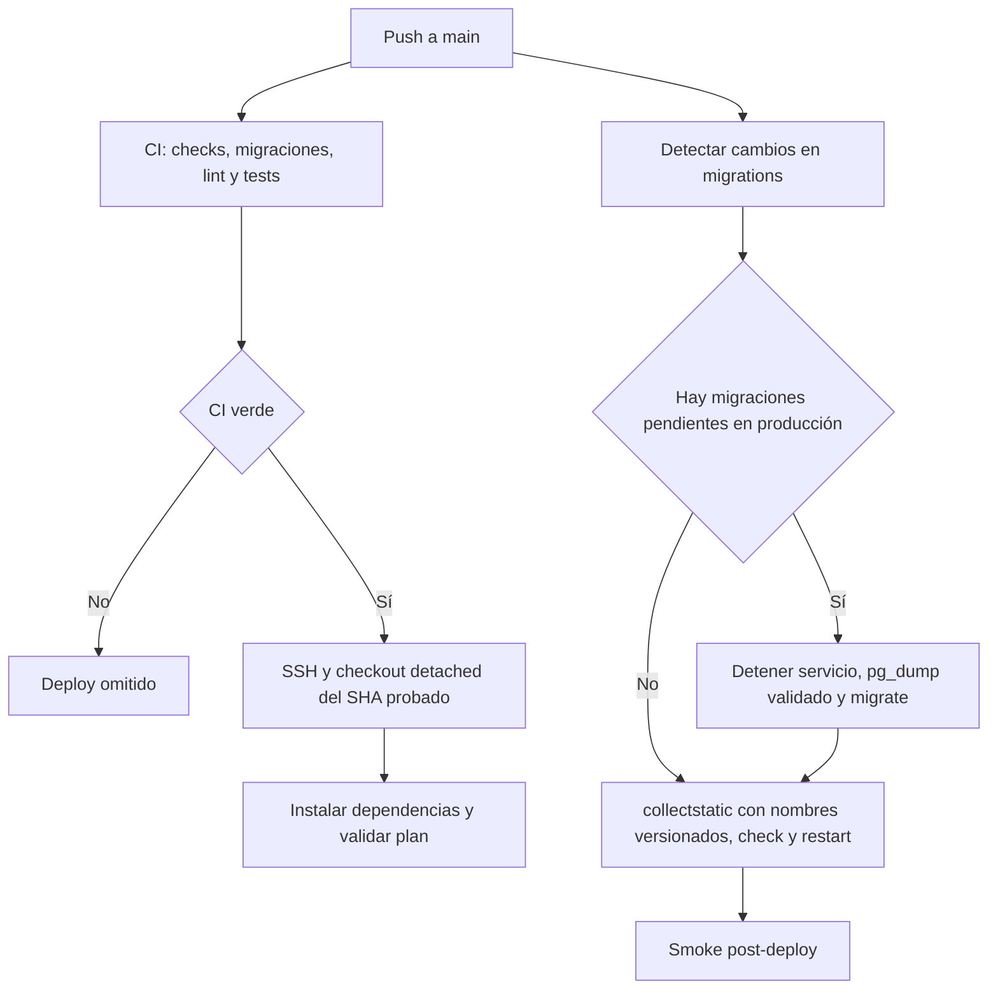

# Deploy

Fecha de actualizacion: 2026-08-18

## Objetivo
Este documento describe el CI/CD minimo del proyecto:
- todo push a `main` ejecuta primero el gate completo sobre PostgreSQL aislado;
- el job `deploy` depende explícitamente de `test`, exige `success()` y no inicia
  si falla un check, Ruff o una prueba;
- CI rechaza cambios de modelos sin migración y detecta archivos bajo
  `*/migrations/*.py` en el rango del push;
- un push sin cambios de esquema despliega automáticamente tras CI verde; un push
  con migraciones deja `deploy` omitido;
- el servidor verifica un checkout limpio y cambia al hash probado en modo
  detached, sin `git reset --hard origin/main`;
- el deploy genérico instala dependencias, recopila estáticos y reinicia
  `systemd`; nunca ejecuta migraciones.

Toda migración, incluida la reparación defensiva de `asistencias.0005`, usa un
release escalonado y no el deploy automático. Su procedimiento exacto está en
[MIGRACIONES_OPERACION_PROFESOR.md](MIGRACIONES_OPERACION_PROFESOR.md).

La reparación de `asistencias.0005` usa exclusivamente
`.github/workflows/release-asistencias-escalonado.yml`. Un tag anotado
`release/asistencias-*` activa el preflight y, solo si es válido, el apply bajo
concurrencia exclusiva. No se debe volver a ejecutar una liberación escalonada
directamente por SSH.

## Estrategia elegida
- No se usa Docker, Compose ni self-hosted runner.
- Se usa `systemd + gunicorn + deploy por SSH`.
- Es la opcion mas simple y mantenible para este repo porque:
  - el proyecto es Django puro
  - ya existe servidor con acceso SSH
  - no hay evidencia de otro orquestador en el codigo
  - evita agregar infraestructura innecesaria

## Archivos creados
- `.github/workflows/deploy.yml`
- `scripts/deploy.sh`
- `scripts/release_operacion_profesor.sh`
- `scripts/release_asistencias_0005.sh`
- `scripts/validar_gate_ci.py`
- `scripts/smoke_produccion.sh`
- `asistencias/management/commands/verificar_smoke_profesor.py`
- `deploy/systemd/plataforma-elemental.service.example`

## Secrets de GitHub Actions

### Obligatorios
- `DEPLOY_HOST`
  - host o IP del servidor
- `DEPLOY_USER`
  - usuario SSH de despliegue
- `DEPLOY_SSH_KEY_B64`
  - clave privada SSH exclusiva para GitHub Actions, codificada en Base64
  - debe ser una clave nueva de deploy, sin passphrase
  - el workflow la usa para escribir `~/.ssh/deploy_key`
- `DEPLOY_PATH`
  - ruta absoluta del repo en el servidor, por ejemplo `/srv/plataformaelemental`
- `DEPLOY_SERVICE`
  - nombre del servicio systemd, por ejemplo `plataforma-elemental`
  - el script acepta `plataforma-elemental` o `plataforma-elemental.service`
- `DEPLOY_ENV_FILE`
  - ruta absoluta del archivo de entorno productivo del servidor, por ejemplo `/srv/elementos/.env.prod`
  - `scripts/deploy.sh` falla si esta variable viene vacia o si el archivo no existe
  - es una ruta, no el contenido del archivo; GitHub Actions la pasa por SSH y el servidor carga el archivo local
## Archivo de entorno productivo

`DEPLOY_ENV_FILE` identifica un archivo existente solo en el servidor. `scripts/deploy.sh` lo carga para validaciones, y el unit de systemd debe referenciar el mismo archivo mediante `EnvironmentFile` para Gunicorn.

El archivo debe incluir las credenciales sensibles (`DJANGO_SECRET_KEY`, PostgreSQL y `GOOGLE_OAUTH_CLIENT_ID` / `GOOGLE_OAUTH_CLIENT_SECRET`) y las configuraciones no sensibles de Django, hosts, cookies y HSTS. No se copia a GitHub Actions, no se imprime y no se versiona.

El smoke manual lee además, solo desde ese archivo local del servidor:

```dotenv
DEPLOY_SMOKE_BASE_URL=https://apps.espacioelementos.cl
DEPLOY_SMOKE_HOST=apps.espacioelementos.cl
DEPLOY_SMOKE_PROFESOR_USERNAME=usuario_smoke_existente
DEPLOY_SMOKE_PROFESOR_ORG_ID=1
DEPLOY_SMOKE_FOREIGN_ORG_ID=2
```

La cuenta debe estar activa, tener `PersonaRol(PROFESOR, activo=True)` únicamente
en la organización autorizada del smoke y no tenerlo en la organización ajena.
No se guarda su contraseña en GitHub: el comando usa una sesión firmada temporal
en memoria y no persiste una sesión Django.

Para el despliegue oscuro inicial, mantener explícitamente:

```dotenv
GOOGLE_AUTH_ENABLED=false
ACCESS_REQUESTS_ENABLED=false
ACCESS_REQUEST_APPROVAL_ENABLED=false
GOOGLE_AUTH_ENFORCED=false
```

Los jobs de prueba también fijan esos cuatro flags en `false` de forma explícita.

### Opcionales
- `DEPLOY_PORT`
  - puerto SSH, normalmente `22`
  - si no existe, el workflow usa `22`
- `DEPLOY_VENV_DIR`
  - ruta absoluta del virtualenv si no quieres usar `.venv` dentro del repo
  - si no existe, usa `.venv` en el repo
- `DEPLOY_PYTHON_BIN`
  - binario python a usar para crear el virtualenv, por ejemplo `python3.13`
  - si no existe, usa `python3`

## Llave SSH de deploy

No intentes adaptar tu llave actual con passphrase al pipeline.
Lo sensato es preparar una llave nueva de deploy, separada, sin passphrase, con su publica en `authorized_keys` del servidor.

### Crear la llave nueva

En tu maquina local:

```bash
ssh-keygen -t ed25519 -C "github-actions-deploy@plataforma-elemental" -f ~/.ssh/plataforma_elemental_deploy -N ""
```

Eso genera:
- privada: `~/.ssh/plataforma_elemental_deploy`
- publica: `~/.ssh/plataforma_elemental_deploy.pub`

### Instalar la publica en el servidor

Con otro acceso ya funcional al servidor:

```bash
mkdir -p ~/.ssh
chmod 700 ~/.ssh
cat ~/.ssh/plataforma_elemental_deploy.pub >> ~/.ssh/authorized_keys
chmod 600 ~/.ssh/authorized_keys
```

Si la vas a instalar para otro usuario:

```bash
sudo -u USUARIO mkdir -p /home/USUARIO/.ssh
sudo -u USUARIO chmod 700 /home/USUARIO/.ssh
sudo -u USUARIO bash -c 'cat >> /home/USUARIO/.ssh/authorized_keys' < ~/.ssh/plataforma_elemental_deploy.pub
sudo chmod 600 /home/USUARIO/.ssh/authorized_keys
sudo chown -R USUARIO:USUARIO /home/USUARIO/.ssh
```

### Cargar la privada en GitHub

En GitHub:
1. Ir a `Settings`
2. `Secrets and variables`
3. `Actions`
4. Crear el secret `DEPLOY_SSH_KEY_B64` con la clave privada codificada en Base64.

En Linux GNU:

```bash
base64 -w 0 ~/.ssh/plataforma_elemental_deploy
```

Alternativa portable:

```bash
base64 < ~/.ssh/plataforma_elemental_deploy | tr -d '\n'
```

### Probar antes del workflow

```bash
ssh -i ~/.ssh/plataforma_elemental_deploy -o IdentitiesOnly=yes -p 22 USUARIO@HOST
```

Si eso no funciona desde tu maquina, el workflow tampoco va a funcionar.

## Variables de servidor esperadas
En el archivo de entorno de produccion conviene definir al menos:
- `DJANGO_ENV=prod`
- `DJANGO_SECRET_KEY`
- `DJANGO_ALLOWED_HOSTS` y `DJANGO_CSRF_TRUSTED_ORIGINS`
- `GOOGLE_OAUTH_CLIENT_ID` y `GOOGLE_OAUTH_CLIENT_SECRET`
- los cuatro flags de Google y solicitudes, inicialmente en `false`
- `POSTGRES_DB`
- `POSTGRES_USER`
- `POSTGRES_PASSWORD`
- `POSTGRES_HOST`
- `POSTGRES_PORT`

El deploy en produccion usa estas mismas variables para ejecutar un backup con
`pg_dump` antes de aplicar migraciones. Cuando existan migraciones pendientes,
también exige `DEPLOY_BACKUP_DIR`, configurable como secret de Actions o dentro
del environment file productivo: una ruta absoluta, persistente, existente,
escribible y ubicada fuera del checkout y de `/tmp`.

Dominio publico vigente:
- `apps.espacioelementos.cl`

Valores recomendados:
- `DJANGO_ALLOWED_HOSTS=apps.espacioelementos.cl`
- `DJANGO_CSRF_TRUSTED_ORIGINS=https://apps.espacioelementos.cl`

Nota operativa:
- `DEPLOY_HOST` es el host/IP usado para SSH por GitHub Actions. No necesariamente debe ser el mismo dominio publico de Django.
- El workflow `.github/workflows/deploy.yml` y `scripts/deploy.sh` no tienen dominio publico hardcodeado; el dominio publico se controla desde settings y variables de entorno del servidor.

## Instalacion inicial en el servidor
1. Instalar dependencias base del sistema:
   - `git`
   - `python3`
   - `python3-venv`
2. Clonar el repo en la ruta final:
   - `git clone <repo> /srv/plataformaelemental`
3. Crear el archivo de entorno de produccion.
4. Asegurar que el usuario de despliegue pueda reiniciar el servicio:
   - idealmente con `sudo` sin password para `systemctl restart` y `systemctl is-active`
   - ese mismo usuario debe ser el que figura en `DEPLOY_USER`
5. Ajustar el unit file desde `deploy/systemd/plataforma-elemental.service.example`:
   - reemplazar `__SERVICE_USER__`
   - reemplazar `__APP_DIR__`
   - reemplazar `__ENV_FILE__`
   - reemplazar `__VENV_DIR__`
6. Instalar el servicio:
   - copiarlo a `/etc/systemd/system/plataforma-elemental.service`
   - `sudo systemctl daemon-reload`
   - `sudo systemctl enable plataforma-elemental`
7. Configurar los secrets de Actions y hacer un push a `main` para ejecutar el
   deploy automático. Definir `DEPLOY_BACKUP_DIR` antes de liberar cualquier
   migración nueva.

## Flujo del workflow

> Excepción manual: no usar este flujo para el release archivado
> `release/operacion-profesor-20260810.1` ni para el candidato
> `release/asistencias-0005-20260818.1`. Ambos están marcados
> `MANUAL_RELEASE_ONLY=1`. La reparación `0005` requiere el
> [runbook vigente](MIGRACIONES_OPERACION_PROFESOR.md#runbook-vigente-para-asistencias0005)
> y no puede pasar por `scripts/deploy.sh`.

Este diagrama resume el flujo real documentado del workflow y `scripts/deploy.sh`.



1. cada push a `main` corre `check`, `makemigrations --check --dry-run`, Ruff y
   la suite Django sobre PostgreSQL aislado;
2. el job `cambios_esquema` informa si el push contiene archivos de migración,
   pero no sustituye la comprobación efectiva de migraciones pendientes contra
   la base productiva;
3. con CI verde, `deploy` valida secrets, hace checkout detached del SHA probado
   e instala dependencias;
4. si `migrate --check` detecta pendientes, valida `DEPLOY_BACKUP_DIR`, detiene
   el servicio, crea un dump PostgreSQL custom, valida su catálogo, guarda su
   SHA-256 y ejecuta `migrate --noinput`;
5. la reparación histórica de Operación Profesor `0004b–0007` sigue bloqueada
   en este camino si está pendiente y requiere su runbook escalonado;
6. finalmente ejecuta `collectstatic` con nombres versionados por contenido,
   normaliza todo `STATIC_ROOT` a directorios `0755` y archivos `0644`, verifica
   los recursos mínimos de Admin y Profesor, ejecuta `check --deploy`, reinicia
   `systemd` y comprueba que quede activo.

## Base De Datos En CI
- El entorno `dev` usa PostgreSQL.
- El job `test` levanta un service container `postgres:16`.
- El workflow define `POSTGRES_DB=plataforma_elemental_ci`,
  `POSTGRES_USER=elemental_ci`, `POSTGRES_PASSWORD=elemental_ci_only`,
  `POSTGRES_HOST=127.0.0.1` y `POSTGRES_PORT=5432` solo para CI.
- Las credenciales de CI no son credenciales productivas; existen solo dentro del runner.
- Django crea `test_plataforma_elemental_ci` para cada ejecución y la elimina al
  terminar porque el workflow no usa `--keepdb`. GitHub Actions destruye además
  el contenedor PostgreSQL junto con el runner efímero.
- El job no carga `.env.prod`, `DEPLOY_ENV_FILE` ni secrets de PostgreSQL.
- SQLite no forma parte de settings ni del pipeline; PostgreSQL es obligatorio.
- `.github/workflows/test.yml` ejecuta el mismo conjunto completo en `pull_request` o `workflow_dispatch`, incluido `makemigrations --check --dry-run`, con PostgreSQL 16 y sin pasos de SSH, migración productiva ni deploy. Es la vía segura para validar una rama antes de integrarla a `main`.

## SSH En CI
- El workflow valida `DEPLOY_SSH_KEY_B64` como secret obligatorio.
- El workflow actual escribe `~/.ssh/deploy_key` a partir de `DEPLOY_SSH_KEY_B64`, decodificandolo con `base64 -d`.
- `DEPLOY_SSH_KEY_B64` debe contener la misma llave privada de deploy, codificada en una sola linea Base64.
- El comando `ssh` usa `-i ~/.ssh/deploy_key` y `IdentitiesOnly=yes` para no depender de nombres por defecto de OpenSSH.
- El workflow no debe imprimir contenido, primeras lineas, ultimas lineas ni fingerprints de la llave en logs.

## Que hace `scripts/deploy.sh`
- exige `DEPLOY_ENV_FILE`
- exige `DEPLOY_EXPECTED_COMMIT`, `DEPLOY_PREVIOUS_COMMIT`, un worktree limpio y
  que `HEAD` coincida exactamente con el SHA probado;
- carga variables desde `DEPLOY_ENV_FILE`
- valida `DJANGO_ENV=prod`
- valida que PostgreSQL apunte a la base productiva esperada;
- crea virtualenv si no existe
- instala dependencias
- ejecuta `python manage.py makemigrations --check --dry-run`
- ejecuta `python manage.py clearsessions`
- ejecuta `python manage.py collectstatic --noinput`
- ejecuta `python manage.py check --deploy`
- normaliza `DEPLOY_SERVICE` para aceptar nombre con o sin sufijo `.service`
- valida que el unit exista con `systemctl show`
- reinicia el servicio systemd

## Deploy v1.0 con logos de organización
Checklist operativo para validar el deploy que incluye `Organizacion.logo`:

1. Confirmar que `Pillow` esta en `requirements.txt`.
2. Confirmar que el workflow remoto ejecuta `pip install -r requirements.txt` mediante `scripts/deploy.sh`.
3. Hacer push a `main` sin migraciones y confirmar que CI activa el deploy.
4. Si el cambio incluye una migración, usar el release escalonado antes de
   publicar código que dependa de ella.
5. Confirmar que `python manage.py check --deploy` corre en el script.
6. Confirmar que `python manage.py collectstatic --noinput` corre en el script.
7. Confirmar que Gunicorn/systemd se reinicia y queda activo.
8. Confirmar `MEDIA_URL` y `MEDIA_ROOT`.
9. Confirmar que el usuario que ejecuta Gunicorn puede escribir en `MEDIA_ROOT`.
10. Confirmar que Nginx sirve `/media/`.
11. Entrar a Django Admin.
12. Subir logo a una organizacion.
13. Verificar topbar con una organizacion con logo.
14. Verificar que una organizacion sin logo usa iniciales.
15. Verificar que organizacion `Todas` muestra `Elemental Apps`.
16. Revisar logs de Gunicorn y Nginx si algo falla.

Fallback de Pillow:
- En Python 3.13, `Pillow==11.3.0` deberia instalarse desde wheel manylinux con `pip`.
- No se agregan paquetes `apt` por defecto.
- Si `pip install -r requirements.txt` falla compilando Pillow, revisar version de Python, arquitectura del servidor y disponibilidad de wheel.
- Solo si no hay wheel disponible, instalar dependencias del sistema para compilar Pillow segun la distribucion del servidor.

## Gate de versión Python

- `AGENTS.md`, `test.yml` y el job previo al deploy en `deploy.yml` usan Python
  3.12.
- La versión del runner no demuestra la versión efectiva del servidor.
- `scripts/deploy.sh` reutiliza el Python del virtualenv productivo existente. `DEPLOY_PYTHON_BIN` solo interviene al crear ese virtualenv.
- El unit de Gunicorn ejecuta el binario dentro del mismo virtualenv productivo.

Antes de autorizar producción se debe comprobar en Gate 3, sin inferencias:

1. versión de `python` dentro del virtualenv productivo;
2. versión que instaló las dependencias;
3. intérprete del proceso Gunicorn;
4. compatibilidad de esa versión con las validaciones realizadas en Python 3.12.

No se autoriza release mientras el runtime productivo siga sin confirmar o sea
incompatible con Python 3.12.

## Media files públicos y protegidos
Configuracion Django vigente:

```python
MEDIA_URL = "/media/"
MEDIA_ROOT = BASE_DIR / "media"
```

En producción Django no sirve archivos directamente desde `MEDIA_ROOT`. Sin embargo, Nginx tampoco debe publicar todo ese directorio: contiene logos públicos y archivos financieros protegidos.

Clasificación:

- público: `media/organizaciones/logos/`;
- protegido: `media/finanzas/documentos/pdf/`, `media/finanzas/documentos/xml/`, `media/finanzas/transactions/` y `media/finanzas/importaciones_tmp/`.

Los archivos protegidos se descargan o visualizan exclusivamente por rutas Django con autorización. Nginx solo publica los logos.

Bloque sugerido, ajustando la ruta real al `MEDIA_ROOT` de produccion:

```nginx
location ^~ /media/organizaciones/logos/ {
    alias /srv/elementos/plataformaelemental/media/organizaciones/logos/;
}

location /media/ {
    return 404;
}
```

Validaciones:
- La ruta pública del `alias` debe coincidir con `MEDIA_ROOT/organizaciones/logos/`.
- Nginx necesita permisos de lectura únicamente sobre la carpeta pública.
- El usuario que ejecuta Gunicorn necesita permisos de escritura para subir logos desde Django Admin.
- Solicitar directamente una ruta bajo `/media/finanzas/` debe responder `404`.
- Las rutas Django de documentos y transacciones deben seguir entregando archivos solo al actor y organización autorizados.
- Si `/media/` no esta configurado, la plataforma sigue funcionando con fallback de iniciales o `Elemental Apps`, pero los logos subidos no se serviran correctamente.

La configuración efectiva de Nginx debe comprobarse en el servidor durante el Gate 3. No se puede declarar seguro el despliegue únicamente porque las vistas Django estén protegidas.

## Backup PostgreSQL Para Releases Con Migraciones

El deploy automático crea un dump custom antes de toda migración rutinaria,
valida que `pg_restore` pueda leer su catálogo y guarda un checksum SHA-256 junto
al archivo. No elimina respaldos automáticamente: la retención corresponde a
infraestructura. El procedimiento histórico de `asistencias.0005` conserva sus
controles adicionales —snapshot, restauración ensayada y revisión humana— en
[MIGRACIONES_OPERACION_PROFESOR.md](MIGRACIONES_OPERACION_PROFESOR.md).

## Rollback

No existe un rollback genérico seguro después de migraciones de datos. Antes de
cada release se registra el `HEAD` productivo real, no `origin/main`. El runbook
de cada release debe declarar si ese código anterior entiende el esquema y los
estados que puede escribir la versión nueva.

Nunca se ejecutan automáticamente migraciones hacia atrás ni una restauración de
PostgreSQL. Si el código anterior no es compatible, se mantiene mantenimiento y
se prepara una corrección forward. Restaurar un dump es un procedimiento
excepcional y puede perder todas las escrituras posteriores al momento del dump.
Para Operación Profesor, `d4a4e48` **no** se declara compatible después de
aplicar `asistencias.0004` o usar la nueva operación; ver su runbook específico.

## Riesgos detectados en el proyecto
- `package.json` y `node_modules/` existen en el repo, pero no forman parte del stack real de deploy.
- `gunicorn` no estaba declarado como dependencia de produccion; se agrego a `requirements.txt`.
- No hay hasta ahora configuracion de `systemd`, `nginx` o proceso WSGI versionada; por eso se agrega el unit file ejemplo.
- El workflow aborta ante cambios locales y usa checkout detached del SHA exacto;
  un worktree productivo sucio debe resolverse manualmente antes de desplegar.
- `python manage.py check --deploy` se ejecuta automaticamente y puede mostrar warnings de seguridad; bloquea el deploy solo si Django retorna error.
- Si `DEPLOY_SSH_KEY_B64` esta mal cargado, el workflow fallara antes de intentar el SSH remoto.
- Si `DJANGO_SECRET_KEY` es corto, repetitivo o empieza con `django-insecure-`, Django mostrara `security.W009` en deploy; no siempre bloquea, pero debe corregirse en produccion.
- La aprobación efectiva depende de configurar revisores obligatorios en el
  environment GitHub `production`; declararlo en YAML por sí solo no crea esa
  política en el repositorio.
- Un valor desconocido de `DJANGO_ENV` se resuelve como `dev`; el entorno
  productivo debe comprobar el valor exacto antes de iniciar procesos.
- El smoke manual verifica `/` → login, `/accounts/login/` → `200` y el contrato
  Profesor `200/404` con organizaciones autorizada/ajena. No prueba OAuth Google,
  escritura de media ni restaurabilidad del backup.
- El workflow automático no ejecuta el smoke. No existe rollback automático de
  migraciones ni restauración automática del dump.
- Nginx sirve los estáticos de todas las apps desde el mismo `STATIC_ROOT`.
  El deploy no selecciona apps: recolecta el repositorio completo y falla si no
  quedan legibles los recursos base de Admin o los CSS/JS de Profesor.
- El deploy valida el catálogo con `pg_restore --list`, pero no restaura el dump
  en una base aislada. Un respaldo no debe llamarse recuperable hasta probar una
  restauración completa fuera de la ventana de deploy.

## Recomendaciones inmediatas
- usar un usuario de despliegue dedicado
- servir Django detras de Nginx o un proxy equivalente
- no hacer cambios manuales dentro del clon de produccion
- mantener `DEPLOY_ENV_FILE` apuntando a un archivo real con `DJANGO_ENV=prod`, `DJANGO_SECRET_KEY`, hosts permitidos y variables de seguridad de sesion.
