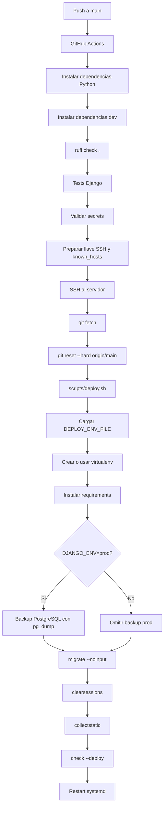
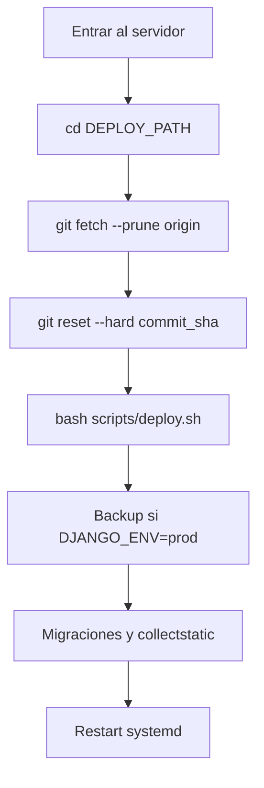

# Deploy

Fecha de actualizacion: 2026-08-09

## Objetivo
Este documento describe el CI/CD minimo del proyecto:
- GitHub Actions ejecuta tests
- si el push entra a `main`, despliega por SSH al servidor
- el servidor actualiza codigo, instala dependencias, migra, recopila estaticos y reinicia `systemd`

## Estrategia elegida
- No se usa Docker, Compose ni self-hosted runner.
- Se usa `systemd + gunicorn + deploy por SSH`.
- Es la opcion mas simple y mantenible para este repo porque:
  - el proyecto es Django puro
  - ya existe servidor con acceso SSH
  - no hay evidencia de otro orquestador en el codigo
  - evita agregar infraestructura innecesaria

## Archivos creados
- `.github/workflows/deploy.yml`
- `scripts/deploy.sh`
- `deploy/systemd/plataforma-elemental.service.example`

## Secrets de GitHub Actions

### Obligatorios
- `DEPLOY_HOST`
  - host o IP del servidor
- `DEPLOY_USER`
  - usuario SSH de despliegue
- `DEPLOY_SSH_KEY_B64`
  - clave privada SSH exclusiva para GitHub Actions, codificada en Base64
  - debe ser una clave nueva de deploy, sin passphrase
  - el workflow la usa para escribir `~/.ssh/deploy_key`
- `DEPLOY_PATH`
  - ruta absoluta del repo en el servidor, por ejemplo `/srv/plataformaelemental`
- `DEPLOY_SERVICE`
  - nombre del servicio systemd, por ejemplo `plataforma-elemental`
  - el script acepta `plataforma-elemental` o `plataforma-elemental.service`
- `DEPLOY_ENV_FILE`
  - ruta absoluta del archivo de entorno productivo del servidor, por ejemplo `/srv/elementos/.env.prod`
  - `scripts/deploy.sh` falla si esta variable viene vacia o si el archivo no existe
  - es una ruta, no el contenido del archivo; GitHub Actions la pasa por SSH y el servidor carga el archivo local

## Archivo de entorno productivo

`DEPLOY_ENV_FILE` identifica un archivo existente solo en el servidor. `scripts/deploy.sh` lo carga para migraciones y validaciones, y el unit de systemd debe referenciar el mismo archivo mediante `EnvironmentFile` para Gunicorn.

El archivo debe incluir las credenciales sensibles (`DJANGO_SECRET_KEY`, PostgreSQL y `GOOGLE_OAUTH_CLIENT_ID` / `GOOGLE_OAUTH_CLIENT_SECRET`) y las configuraciones no sensibles de Django, hosts, cookies y HSTS. No se copia a GitHub Actions, no se imprime y no se versiona.

Para el despliegue oscuro inicial, mantener explícitamente:

```dotenv
GOOGLE_AUTH_ENABLED=false
ACCESS_REQUESTS_ENABLED=false
ACCESS_REQUEST_APPROVAL_ENABLED=false
GOOGLE_AUTH_ENFORCED=false
```

Los jobs de prueba también fijan esos cuatro flags en `false` de forma explícita.

### Opcionales
- `DEPLOY_PORT`
  - puerto SSH, normalmente `22`
  - si no existe, el workflow usa `22`
- `DEPLOY_VENV_DIR`
  - ruta absoluta del virtualenv si no quieres usar `.venv` dentro del repo
  - si no existe, usa `.venv` en el repo
- `DEPLOY_PYTHON_BIN`
  - binario python a usar para crear el virtualenv, por ejemplo `python3.13`
  - si no existe, usa `python3`

## Llave SSH de deploy

No intentes adaptar tu llave actual con passphrase al pipeline.
Lo sensato es preparar una llave nueva de deploy, separada, sin passphrase, con su publica en `authorized_keys` del servidor.

### Crear la llave nueva

En tu maquina local:

```bash
ssh-keygen -t ed25519 -C "github-actions-deploy@plataforma-elemental" -f ~/.ssh/plataforma_elemental_deploy -N ""
```

Eso genera:
- privada: `~/.ssh/plataforma_elemental_deploy`
- publica: `~/.ssh/plataforma_elemental_deploy.pub`

### Instalar la publica en el servidor

Con otro acceso ya funcional al servidor:

```bash
mkdir -p ~/.ssh
chmod 700 ~/.ssh
cat ~/.ssh/plataforma_elemental_deploy.pub >> ~/.ssh/authorized_keys
chmod 600 ~/.ssh/authorized_keys
```

Si la vas a instalar para otro usuario:

```bash
sudo -u USUARIO mkdir -p /home/USUARIO/.ssh
sudo -u USUARIO chmod 700 /home/USUARIO/.ssh
sudo -u USUARIO bash -c 'cat >> /home/USUARIO/.ssh/authorized_keys' < ~/.ssh/plataforma_elemental_deploy.pub
sudo chmod 600 /home/USUARIO/.ssh/authorized_keys
sudo chown -R USUARIO:USUARIO /home/USUARIO/.ssh
```

### Cargar la privada en GitHub

En GitHub:
1. Ir a `Settings`
2. `Secrets and variables`
3. `Actions`
4. Crear el secret `DEPLOY_SSH_KEY_B64` con la clave privada codificada en Base64.

En Linux GNU:

```bash
base64 -w 0 ~/.ssh/plataforma_elemental_deploy
```

Alternativa portable:

```bash
base64 < ~/.ssh/plataforma_elemental_deploy | tr -d '\n'
```

### Probar antes del workflow

```bash
ssh -i ~/.ssh/plataforma_elemental_deploy -o IdentitiesOnly=yes -p 22 USUARIO@HOST
```

Si eso no funciona desde tu maquina, el workflow tampoco va a funcionar.

## Variables de servidor esperadas
En el archivo de entorno de produccion conviene definir al menos:
- `DJANGO_ENV=prod`
- `DJANGO_SECRET_KEY`
- `DJANGO_ALLOWED_HOSTS` y `DJANGO_CSRF_TRUSTED_ORIGINS`
- `GOOGLE_OAUTH_CLIENT_ID` y `GOOGLE_OAUTH_CLIENT_SECRET`
- los cuatro flags de Google y solicitudes, inicialmente en `false`
- `POSTGRES_DB`
- `POSTGRES_USER`
- `POSTGRES_PASSWORD`
- `POSTGRES_HOST`
- `POSTGRES_PORT`

El deploy en produccion usa estas mismas variables para ejecutar un backup con `pg_dump` antes de aplicar migraciones.

Dominio publico vigente:
- `apps.espacioelementos.cl`

Valores recomendados:
- `DJANGO_ALLOWED_HOSTS=apps.espacioelementos.cl`
- `DJANGO_CSRF_TRUSTED_ORIGINS=https://apps.espacioelementos.cl`

Nota operativa:
- `DEPLOY_HOST` es el host/IP usado para SSH por GitHub Actions. No necesariamente debe ser el mismo dominio publico de Django.
- El workflow `.github/workflows/deploy.yml` y `scripts/deploy.sh` no tienen dominio publico hardcodeado; el dominio publico se controla desde settings y variables de entorno del servidor.

## Instalacion inicial en el servidor
1. Instalar dependencias base del sistema:
   - `git`
   - `python3`
   - `python3-venv`
2. Clonar el repo en la ruta final:
   - `git clone <repo> /srv/plataformaelemental`
3. Crear el archivo de entorno de produccion.
4. Asegurar que el usuario de despliegue pueda reiniciar el servicio:
   - idealmente con `sudo` sin password para `systemctl restart` y `systemctl is-active`
   - ese mismo usuario debe ser el que figura en `DEPLOY_USER`
5. Ajustar el unit file desde `deploy/systemd/plataforma-elemental.service.example`:
   - reemplazar `__SERVICE_USER__`
   - reemplazar `__APP_DIR__`
   - reemplazar `__ENV_FILE__`
   - reemplazar `__VENV_DIR__`
6. Instalar el servicio:
   - copiarlo a `/etc/systemd/system/plataforma-elemental.service`
   - `sudo systemctl daemon-reload`
   - `sudo systemctl enable plataforma-elemental`
7. Ejecutar una primera vez:
   - `cd /srv/plataformaelemental`
   - `bash scripts/deploy.sh`

## Flujo del workflow

> Excepción Operación Profesor 2026-08-10: no usar este flujo automático para
> las migraciones `asistencias.0004` y `finanzas.0012`. El workflow no separa
> mantenimiento, reporte, activación y migraciones. Publicar el release en una
> rama/tag que no sea `main` y seguir el
> [runbook manual](MIGRACIONES_OPERACION_PROFESOR.md#runbook-manual-de-producción-para-el-piloto).
> Un push directo a `main` dispara despliegue automático.

Este diagrama resume el flujo real documentado del workflow y `scripts/deploy.sh`.



1. `actions/checkout`
2. instalar dependencias Python
3. instalar dependencias de desarrollo para lint
4. correr `ruff check .`
5. correr `python manage.py test`
6. validar secrets obligatorios
7. escribir la llave privada en `~/.ssh/deploy_key`
8. validar que la llave sea una privada SSH correcta y sin passphrase interactiva
9. poblar `known_hosts` con `ssh-keyscan`
10. abrir SSH al servidor usando `-i ~/.ssh/deploy_key`
11. `git fetch`
12. `git reset --hard origin/main`
13. ejecutar `bash scripts/deploy.sh`

## Base De Datos En CI
- El entorno `dev` usa PostgreSQL.
- El job `test` levanta un service container `postgres:16`.
- El workflow define `POSTGRES_DB=plataforma_elemental_dev`, `POSTGRES_USER=elementos`, `POSTGRES_PASSWORD=postgres`, `POSTGRES_HOST=127.0.0.1` y `POSTGRES_PORT=5432` solo para CI.
- Las credenciales de CI no son credenciales productivas; existen solo dentro del runner.
- SQLite no forma parte de settings ni del pipeline; PostgreSQL es obligatorio.
- `.github/workflows/test.yml` ejecuta el mismo conjunto completo en `pull_request` o `workflow_dispatch`, con PostgreSQL 16 y sin pasos de SSH, migración productiva ni deploy. Es la vía segura para validar una rama antes de integrarla a `main`.

## SSH En CI
- El workflow valida `DEPLOY_SSH_KEY_B64` como secret obligatorio.
- El workflow actual escribe `~/.ssh/deploy_key` a partir de `DEPLOY_SSH_KEY_B64`, decodificandolo con `base64 -d`.
- `DEPLOY_SSH_KEY_B64` debe contener la misma llave privada de deploy, codificada en una sola linea Base64.
- El comando `ssh` usa `-i ~/.ssh/deploy_key` y `IdentitiesOnly=yes` para no depender de nombres por defecto de OpenSSH.
- El workflow no debe imprimir contenido, primeras lineas, ultimas lineas ni fingerprints de la llave en logs.

## Que hace `scripts/deploy.sh`
- exige `DEPLOY_ENV_FILE`
- carga variables desde `DEPLOY_ENV_FILE`
- valida `DJANGO_ENV=prod`
- valida que PostgreSQL apunte a la base productiva esperada antes de migrar
- crea virtualenv si no existe
- instala dependencias
- si `DJANGO_ENV=prod`, ejecuta backup PostgreSQL previo a migraciones usando `pg_dump`
- ejecuta `python manage.py migrate --noinput`
- ejecuta `python manage.py clearsessions`
- ejecuta `python manage.py collectstatic --noinput`
- ejecuta `python manage.py check --deploy`
- normaliza `DEPLOY_SERVICE` para aceptar nombre con o sin sufijo `.service`
- valida que el unit exista con `systemctl show`
- reinicia el servicio systemd

## Deploy v1.0 con logos de organización
Checklist operativo para validar el deploy que incluye `Organizacion.logo`:

1. Confirmar que `Pillow` esta en `requirements.txt`.
2. Confirmar que el workflow remoto ejecuta `pip install -r requirements.txt` mediante `scripts/deploy.sh`.
3. Ejecutar deploy normal por push a `main` o `workflow_dispatch`.
4. Verificar que la migracion `personas.0005_organizacion_logo` se aplica durante `python manage.py migrate --noinput`.
5. Confirmar que `python manage.py check --deploy` corre en el script.
6. Confirmar que `python manage.py collectstatic --noinput` corre en el script.
7. Confirmar que Gunicorn/systemd se reinicia y queda activo.
8. Confirmar `MEDIA_URL` y `MEDIA_ROOT`.
9. Confirmar que el usuario que ejecuta Gunicorn puede escribir en `MEDIA_ROOT`.
10. Confirmar que Nginx sirve `/media/`.
11. Entrar a Django Admin.
12. Subir logo a una organizacion.
13. Verificar topbar con una organizacion con logo.
14. Verificar que una organizacion sin logo usa iniciales.
15. Verificar que organizacion `Todas` muestra `Elemental Apps`.
16. Revisar logs de Gunicorn y Nginx si algo falla.

Fallback de Pillow:
- En Python 3.13, `Pillow==11.3.0` deberia instalarse desde wheel manylinux con `pip`.
- No se agregan paquetes `apt` por defecto.
- Si `pip install -r requirements.txt` falla compilando Pillow, revisar version de Python, arquitectura del servidor y disponibilidad de wheel.
- Solo si no hay wheel disponible, instalar dependencias del sistema para compilar Pillow segun la distribucion del servidor.

## Gate de versión Python

- `AGENTS.md` y el workflow `test.yml` declaran Python 3.12.
- El job de pruebas previo al deploy en `deploy.yml` usa Python 3.13.
- Ese Python 3.13 pertenece al runner de GitHub Actions; no demuestra la versión del servidor.
- `scripts/deploy.sh` reutiliza el Python del virtualenv productivo existente. `DEPLOY_PYTHON_BIN` solo interviene al crear ese virtualenv.
- El unit de Gunicorn ejecuta el binario dentro del mismo virtualenv productivo.

Antes de autorizar producción se debe comprobar en Gate 3, sin inferencias:

1. versión de `python` dentro del virtualenv productivo;
2. versión que instaló las dependencias;
3. intérprete del proceso Gunicorn;
4. compatibilidad de esa versión con las validaciones realizadas en Python 3.12 y con el job de Python 3.13.

No se autoriza release mientras el runtime productivo siga sin confirmar o exista una combinación 3.12/3.13 no validada.

## Media files públicos y protegidos
Configuracion Django vigente:

```python
MEDIA_URL = "/media/"
MEDIA_ROOT = BASE_DIR / "media"
```

En producción Django no sirve archivos directamente desde `MEDIA_ROOT`. Sin embargo, Nginx tampoco debe publicar todo ese directorio: contiene logos públicos y archivos financieros protegidos.

Clasificación:

- público: `media/organizaciones/logos/`;
- protegido: `media/finanzas/documentos/pdf/`, `media/finanzas/documentos/xml/`, `media/finanzas/transactions/` y `media/finanzas/importaciones_tmp/`.

Los archivos protegidos se descargan o visualizan exclusivamente por rutas Django con autorización. Nginx solo publica los logos.

Bloque sugerido, ajustando la ruta real al `MEDIA_ROOT` de produccion:

```nginx
location ^~ /media/organizaciones/logos/ {
    alias /srv/elementos/plataformaelemental/media/organizaciones/logos/;
}

location /media/ {
    return 404;
}
```

Validaciones:
- La ruta pública del `alias` debe coincidir con `MEDIA_ROOT/organizaciones/logos/`.
- Nginx necesita permisos de lectura únicamente sobre la carpeta pública.
- El usuario que ejecuta Gunicorn necesita permisos de escritura para subir logos desde Django Admin.
- Solicitar directamente una ruta bajo `/media/finanzas/` debe responder `404`.
- Las rutas Django de documentos y transacciones deben seguir entregando archivos solo al actor y organización autorizados.
- Si `/media/` no esta configurado, la plataforma sigue funcionando con fallback de iniciales o `Elemental Apps`, pero los logos subidos no se serviran correctamente.

La configuración efectiva de Nginx debe comprobarse en el servidor durante el Gate 3. No se puede declarar seguro el despliegue únicamente porque las vistas Django estén protegidas.

## Backup PostgreSQL Previo A Migraciones
- Solo corre cuando `DJANGO_ENV=prod`.
- Usa `POSTGRES_DB`, `POSTGRES_USER`, `POSTGRES_PASSWORD`, `POSTGRES_HOST` y `POSTGRES_PORT` cargadas desde `DEPLOY_ENV_FILE` o desde el entorno del proceso.
- Guarda los archivos en `$APP_DIR/backups/postgres`.
- El nombre del archivo incluye base de datos, timestamp y commit corto, por ejemplo `plataforma_elemental_20260508_153000_abc1234.dump`.
- El formato es `custom` de `pg_dump`, pensado para restaurar con `pg_restore`.
- Si `pg_dump` falla, el deploy aborta antes de ejecutar migraciones.
- El script no imprime la password; la entrega a `pg_dump` mediante `PGPASSWORD`.

## Rollback simple
Este flujo muestra el rollback manual simple documentado. Asume acceso SSH al servidor y un commit conocido.



En el servidor:

```bash
cd /srv/plataformaelemental
git fetch --prune origin
git reset --hard <commit_sha>
bash scripts/deploy.sh
```

Si quieres volver al ultimo `main`:

```bash
cd /srv/plataformaelemental
git reset --hard origin/main
bash scripts/deploy.sh
```

## Riesgos detectados en el proyecto
- `package.json` y `node_modules/` existen en el repo, pero no forman parte del stack real de deploy.
- `gunicorn` no estaba declarado como dependencia de produccion; se agrego a `requirements.txt`.
- No hay hasta ahora configuracion de `systemd`, `nginx` o proceso WSGI versionada; por eso se agrega el unit file ejemplo.
- El deploy usa `git reset --hard origin/main`; eso es correcto para un clon de despliegue, pero cualquier cambio manual hecho en el servidor se perdera.
- `python manage.py check --deploy` se ejecuta automaticamente y puede mostrar warnings de seguridad; bloquea el deploy solo si Django retorna error.
- Si `DEPLOY_SSH_KEY_B64` esta mal cargado, el workflow fallara antes de intentar el SSH remoto.
- Si `DJANGO_SECRET_KEY` es corto, repetitivo o empieza con `django-insecure-`, Django mostrara `security.W009` en deploy; no siempre bloquea, pero debe corregirse en produccion.
- Un push a `main` inicia deploy automaticamente despues de la suite; el workflow
  no declara un `environment` protegido ni una aprobacion manual.
- Un valor desconocido de `DJANGO_ENV` se resuelve como `dev`; el entorno
  productivo debe comprobar el valor exacto antes de iniciar procesos.
- El healthcheck final solo verifica respuesta HTTP del home y no prueba
  PostgreSQL, Google, escritura de media ni restaurabilidad del backup.
- El repositorio crea backups previos a migraciones, pero no versiona una prueba
  periodica de `pg_restore`; un dump no debe llamarse recuperable hasta probarlo.

## Recomendaciones inmediatas
- usar un usuario de despliegue dedicado
- servir Django detras de Nginx o un proxy equivalente
- no hacer cambios manuales dentro del clon de produccion
- mantener `DEPLOY_ENV_FILE` apuntando a un archivo real con `DJANGO_ENV=prod`, `DJANGO_SECRET_KEY`, hosts permitidos y variables de seguridad de sesion.
